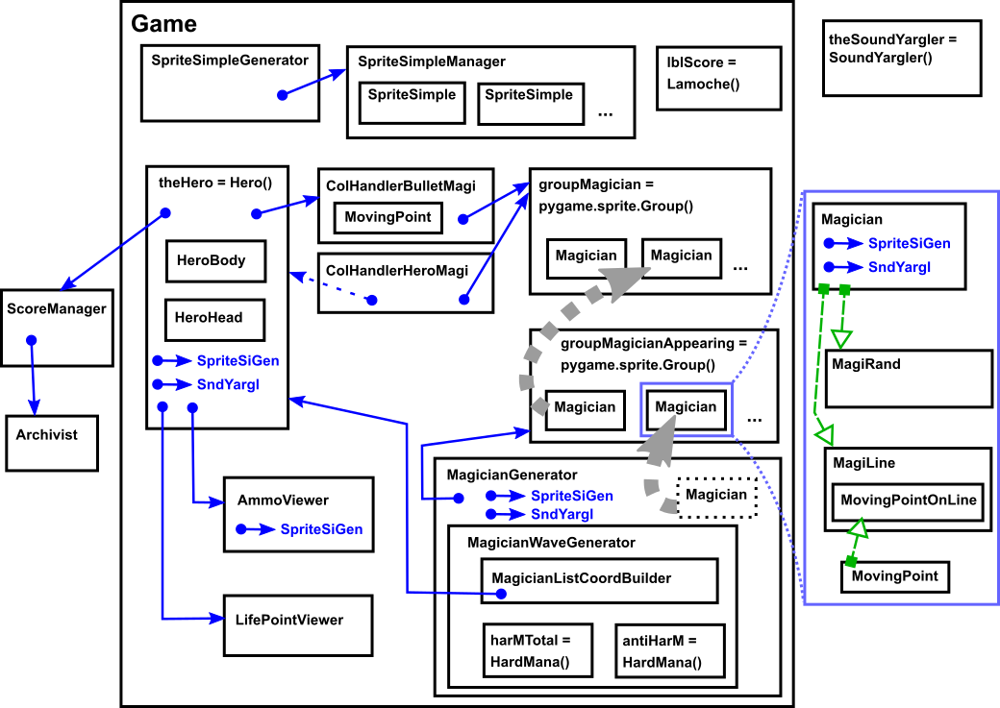

# Document de conception de Blarg (jeu) #

Ce document décrit la manière dont est organisé le code du jeu.

Le code du système d'interface (menu principal, config, ...) est décrit dans le document [DOC_CONCEPTION_menu.md](DOC_CONCEPTION_menu.md) .

## Introduction ##

Le code est assez densément commenté. Ce document se bornera donc à décrire sommairement le but de chaque classe.

Durant la réalisation de ce jeu, le PEP8 a été foulé aux pieds, écartelé, équarri et humilié en place publique par des petits enfants jetant des cailloux. C'est la faute à l'entreprise dans laquelle je bossais à l'époque, qui m'a appris à coder en python avec les conventions de nommage du C++. Il va falloir faire avec !

## Table des matières

- [Document de conception de Blarg (jeu)](#document-de-conception-de-blarg-jeu)
    - [Introduction](#introduction)
    - [Table des matières](#table-des-mati%C3%A8res)
    - [Lancement d'une partie](#lancement-dune-partie)
    - [Diagramme de classe](#diagramme-de-classe)
        - [Légende](#l%C3%A9gende)
    - [Rappel : fonctionnement des sprites avec pygame](#rappel--fonctionnement-des-sprites-avec-pygame)
    - [Description du rôle de chaque classe](#description-du-r%C3%B4le-de-chaque-classe)
        - [game/Game](#gamegame)
        - [common](#common)
        - [sprsimpl/SpriteSimple](#sprsimplspritesimple)
        - [sprsiman/SpriteSimpleManager](#sprsimanspritesimplemanager)
        - [sprsigen/SpriteSimpleGenerator](#sprsigenspritesimplegenerator)
        - [lamoche/Lamoche](#lamochelamoche)
        - [herobody/HeroBody](#herobodyherobody)
        - [herohead/HeroHead](#heroheadherohead)
        - [movpoint/MovingPoint](#movpointmovingpoint)
        - [movline/MovingPointOnLine](#movlinemovingpointonline)
        - [cobulmag/CollHandlerBulletMagi](#cobulmagcollhandlerbulletmagi)
        - [cohermag/CollHandlerHeroMagi](#cohermagcollhandlerheromagi)
        - [scoremn/ScoreManager](#scoremnscoremanager)
        - [ammoview/AmmoViewer](#ammoviewammoviewer)
        - [lifeview/LifePointViewer](#lifeviewlifepointviewer)
        - [hero/Hero](#herohero)
            - [Fonctionnement global du héros](#fonctionnement-global-du-h%C3%A9ros)
            - [Tir](#tir)
            - [Collision avec un magicien](#collision-avec-un-magicien)
            - [Fin de partie](#fin-de-partie)
        - [magician/Magician](#magicianmagician)
            - [cycle de vie](#cycle-de-vie)
        - [magiline/MagiLine](#magilinemagiline)
        - [magirand/MagiRand](#magirandmagirand)
        - [maggen/MagicianGenerator](#maggenmagiciangenerator)
        - [maggenlc/MagicianListCoordBuilder](#maggenlcmagicianlistcoordbuilder)
        - [hardmana/HardMana](#hardmanahardmana)
        - [maggenwa/MagicianWaveGenerator](#maggenwamagicianwavegenerator)
            - [déroulement de la génération des vagues](#d%C3%A9roulement-de-la-g%C3%A9n%C3%A9ration-des-vagues)
            - [Utilisation du hardMana pour générer une nouvelle vague](#utilisation-du-hardmana-pour-g%C3%A9n%C3%A9rer-une-nouvelle-vague)
        - [archiv/Archivist](#archivarchivist)
        - [yargler/SoundYargler](#yarglersoundyargler)
    - [Vocabulaire](#vocabulaire)

## Lancement d'une partie ##

Au démarrage du programme, le système d'interface est initialisé. Ensuite, lors du clic sur l'option "jouer" du menu principal, la fonction `mainclas.py/MainClass.mactPlaySeveralGames` est exécutée. Cette fonction effectue les actions suivantes :

 - Jouer une partie.
 - Afficher l'écran de fin de partie (avec le héros transformé en potion de mana)
 - Éventuellement, redémarrer une partie, et ainsi de suite.

Le jeu en lui-même, sans l'interface, est géré par la classe `game.py/Game`. Pour démarrer une partie, les fonctions suivantes sont exécutées :

    # Instanciation (appelée par MainClass.__init__)
    self.theGame = Game(self.screen, self.scoreManager, self.fontDefault)
    # Chargement des images et d'autres trucs.
    self.theGame.loadGameStuff()
    # Démarrage (appelé par MainClass.mactPlaySeveralGames)
    self.theGame.playOneGame(self.archivist.dicKeyMapping, dogDom)

Les paramètres nécessaires sont les suivants :

 - `self.screen` : objet `pygame.surface.Surface`. Représente l'écran sur lequel s'affichera le jeu.

 - `self.scoreManager` : classe stockant le score de la partie en cours. Permet de récupérer le score final à la fin de la partie.

 - `self.fontDefault` : objet `pygame.font.Font`. Police de caractère utilisée pour afficher les textes durant le jeu. (Le score).

 - `self.archivist.dicKeyMapping` : dictionnaire effectuant la correspondance entre des touches du clavier et les actions. Il est défini par le joueur, durant la configuration.

 - `dogDom` : booléen indiquant si le mode invincible est activé ou pas.

## Diagramme de classe ##

### Légende ###

Boîte avec un titre composé d'un seul mot : instance de classe. Le nom de l'objet instancié et le nom de la classe sont les mêmes, aux majuscules près.

Boîte avec un titre plus compliqué : instance de classe aussi. Format du titre : `nomDeLObjetInstancié = NomDeLaClasse()`.

Cadre bleu clair : zoom sur un endroit spécifique du diagramme, pour afficher plus de détails.

Flèche bleue pleine, de A vers B : Référence "forte". L'objet A possède une référence vers l'objet B, qu'il garde tout le long de sa vie.

Flèche bleue pointillée, de A vers B : Référence "faible". L'objet A n'a pas de référence vers l'objet B. Mais de temps en temps, on appelle une fonction de l'objet A en lui passant l'objet B en paramètre.

Petite flèche bleue vers "SpriteSiGen" : Référence (forte) vers l'objet `SpriteSimpleGenerator`. C'est une référence comme toutes les autres, mais on ne la représente pas de la manière standard, car ça ferait une flèche qui traverse tout le diagramme et ça se terminerait en un gros fouillis.

Petite flèche bleue vers "SndYargl" : Référence (forte) vers l'objet `SoundYargler`.

Flèche verte, de A vers B : héritage. L'objet B est dérivée de l'objet A.

Grosse flèche grise pointillée : déplacement. À un moment de sa vie, l'objet est transféré d'un endroit à un autre.

Boîte avec un cadre pointillé : l'objet est instancié par l'objet englobant, puis il est tout de suite transféré ailleurs.

## Rappel : fonctionnement des sprites avec pygame ##

Les sprites sont gérés par des objets `pygame.sprite.Sprite`. Durant un cycle de jeu, il faut effectuer les actions suivantes :

 - Pour chaque sprite :

    - Effacer à l'écran le rectangle englobant (défini par la position et la taille de l'image courante du sprite). S'il y a une image de fond, il faut la redessiner par-dessus.

    - Exécuter `Sprite.update()` (fonction overridée) : modifie la position et/ou l'image courante du sprite.

    - Exécuter `Sprite.draw()` : dessine le sprite à l'écran.

- Exécuter la fonction `pygame.display.flip()`, afin de rafraîchir l'écran et d'afficher les changements. (Double buffer, tout ça...)

Pygame permet de faciliter ce traitement, avec les groupes de sprite, en particulier, les `pygame.sprite.RenderUpdates`. On commence par exécuter la fonction `RenderUpdates.add()` pour mettre des sprites dans le groupe, puis, à chaque cycle de jeu, on effectue les actions suivantes :

 - `RenderUpdates.clear()`, en indiquant en paramètre l'écran et l'image de fond à redessiner. Cette fonction enregistre en interne une liste de "rectangle sales". C'est à dire les zones de l'écran sur lesquelles un sprite a été clearé.

 - `RenderUpdates.update()` : exécute la fonction `update()` de chaque sprite du groupe.

 - `listDirtyRects = RenderUpdates.draw()`. Dessine à l'écran tous les sprites du groupe. Renvoie la liste des rectangles sales, correspondant à toutes les zones de l'écran où quelque chose a changé (clear et/ou draw).

 - `pygame.display.flip()` : rafraîchit tout l'écran. Si on veut être plus subtil, on peut exécuter à la place `pygame.display.update(listDirtyRects)`, pour rafraîchir uniquement les zones nécessaires.

Durant un cycle, on peut ajouter et enlever des sprites du groupe, avec les fonctions `add` et `remove`. À exécuter entre le `clear` et le `draw`.

## Description du rôle de chaque classe ##

### game/Game ###

Classe principale gérant le jeu en lui-même. Contient la game loop.

Cette classe possède un `RenderUpdates`, appelé `allSprites`, contenant presque tous les sprites du jeu à afficher à l'instant T. La game loop exécute les fonctions `clear()` et `draw()` de `allSprites`.

Elle n'exécute pas `update()`. Cette action est effectuée par divers autres bouts de code. J'ai voulu faire comme ça car certains objets du jeu (en particulier le héros) sont représentés par plusieurs sprites. Il fallait donc mettre le code de gestion de ces objets dans des classes dédiées, et non pas dans un update d'un sprite quelconque qu'on n'aurait pas su à quel objet il se rapporte.

`allSprites` contient donc "presque" tous les sprites du jeu. Les cartouches et les douilles (`ammoViewer.groupBulShell`) ainsi que les points de vie (`lifePointViewer.groupLifePoints`) sont gérés par d'autres modules de code. Il y a peut-être encore d'autres sprites non présents dans `allSprites` (je n'ai pas tout contrôlé), mais à priori non.

### common ###

Module contenant des petites fonctions et des constantes utiles un peu partout. Voir le commentaire de chacun d'eux pour des infos détaillées.

### sprsimpl/SpriteSimple ###

Classe héritée de `pygame.sprite.Sprite`. Permet de gérer des sprites avec :
 - des mouvements simples (vitesse initiale, accélération),
 - des enchaînements d'images simples (en boucle),
 - des conditions de destruction simples (après x boucles / en quittant l'écran).

### sprsiman/SpriteSimpleManager ###

Contient un groupe de `SpriteSimple`. Effectue leurs updates, et les supprime lorsqu'ils sont arrivés en fin de vie.

Cette classe possède une référence vers le gros groupe `allSprites`. Elle s'occupe d'updater et d'ajouter/enlever les `SpriteSimple` dont elle a la charge, au fur et à mesure de leur cycle de vie.

Elle ne s'occupe pas de clearer et dessiner ses sprites. C'est le groupe `allSprites` qui effectue ces tâches, comme il le fait pour tous les autres sprites du jeu.

### sprsigen/SpriteSimpleGenerator ###

Générateur de `SpriteSimple` prédéfinis, correspondant à des éléments spécifiques du jeu (Le "prout" d'un magicien qui meurt en s'envolant, la flamme du fusil du héros, ...)

Le `SpriteSimpleGenerator` contient une référence vers un `SpriteSimpleManager`, dans lequel il ajoutera les sprites générés.

Cette classe est équivalente à un gros tas de constantes, permettant de générer des sprites avec des images, des mouvements et une configuration prédéfinis.

La seule génération plus complexe que les autres est celle des bras et têtes coupées des magiciens. Ce sont des `SpriteSimple` comme les autres, mais il y a un petit traitement initial (avec du random) pour déterminer les images effectuant les gigotages et le tournoiement.

### lamoche/Lamoche ###

Classe héritée de `pygame.sprite.Sprite`. Permet d'afficher un texte à l'écran. Je l'ai appelé "Lamoche" pour faire une blague par rapport au mot "Label". Voilà, c'est drôle.

Cette classe est également utilisée dans le système d'interface.

### herobody/HeroBody ###

Héritée de `pygame.sprite.Sprite`. Affiche le corps du héros. Le choix de l'image à afficher se fait en appelant la méthode `changeImg()`. C'est au code extérieur de décider quelle image afficher en fonction de ce qu'il se passe dans le jeu.

### herohead/HeroHead ###

Héritée de `pygame.sprite.Sprite`. Affiche la tête du héros. Cette classe est d'un niveau un peu plus haut que `HeroBody`, et gère donc un peu plus de choses :

 - Tournage de tête à gauche et à droite : fonction `turnHead()`. (Appelée lorsque le héros meurt)
 - Sourire : fonction `startSmiling()` et `stopSmiling()`. (Appelées lorsque le héros fait exploser un magicien en bouillie).
 - Arrêt automatique du sourire au bout de quelques secondes : fonction `update()`.

### movpoint/MovingPoint ###

classe héritée de `pygame.Rect`. Représente un point se déplaçant dans l'aire de jeu, la direction étant définie à l'instanciation. À chaque cycle, la fonction `advanceOneStep()` est exécutée. La position courante est récupérée par le membre `Rect.topleft`.

Comme on définit un mouvement dans une direction donnée, sans limite, il ne se termine jamais. La fonction `isMoveFinished()` renvoie toujours false.

Cette classe est utilisée pour calculer la trajectoire des balles tirées par le héros.

### movline/MovingPointOnLine ###

classe héritée de `MovingPoint`. Représente un point dans l'aire de jeu se déplaçant le long d'un segment de droite. Les points d'arrivée et de départ sont donnés à l'instanciation.

À chaque exécution de `advanceOneStep()`, on se déplace d'un pixel (en diagonale ou pas, ça dépend de la position courante). La vitesse n'est donc pas atomiquement constante entre deux cycles de jeu, mais on s'en fout.

La fonction `IsMoveFinished()` renvoie True lorsque la position courante est au point d'arrivée.

Cette classe est utilisée pour calculer la trajectoire des magiciens se déplaçant le long d'une ligne (les `MagiLine`).

### cobulmag/CollHandlerBulletMagi ###

À chaque fois que le héros tire, cette classe effectue les actions suivantes :

 - Calcul des trajectoires. Un tir fait partir 3 balles : une un peu vers le haut, une tout droit, et une un peu vers le bas. Elles ont une vitesse instantanée.

 - Détection des collisions entre les balles et les magiciens.

 - Exécution de la fonction `Magician.hitByBullet(Damage)` pour chaque balle touchant un magicien. La valeur renvoyée indique son état (vivant/tué/explosé). Lorsque plusieurs magiciens sont exactement sur la même abscisse et qu'une balle leur arrive dessus, ils sont tous touchés en même temps.

 - Renvoi du nombre total de magiciens tués et explosés par le tir.

D'autre part, ce fichier de code contient des explications détaillées sur les différents états d'un magicien, et les passages d'un état à un autre. Ça n'a peut-être pas sa place ici, mais c'est ainsi. Tralalali.

### cohermag/CollHandlerHeroMagi ###

Gestion des collisions entre le héros (tête + corps) et les magiciens.

Lorsqu'une collision a lieu, on envoie le stimuli `takeStimuliHurt(theMagician.rect)` au héros, et le stimuli `TakeStimuliTouchedHero()` au magicien.

Lorsque le héros reçoit un stimuli de collision, il se met immédiatement dans l'état `HURT`. On ne fait pas d'autres détections de collision tant qu'il reste dans cet état. Cela permet d'éviter que le héros se fasse toucher plusieurs fois en peu de temps, ce qui ne serait pas très gentil envers le joueur.

### scoremn/ScoreManager ###

Récupère les stats d'un joueur à partir d'une classe `Archivist` (la classe gérant le fichier de sauvegarde). Ces stats comprennent les high scores, ainsi que le nombre total de magiciens tués et explosés.

Récupère le nombre de magiciens explosés, et tués sans être explosés, au fur et à mesure de la partie.

Met à jour le score de la partie en cours, les high scores, et les totaux.

À la fin de la partie, renvoie à l'archivist les stats mises à jour, qui les enregistrera dans le fichier.

### ammoview/AmmoViewer ###

Affiche les cartouches à gauche de l'écran, et gère leurs animations :

 - reload : le héros vient de recharger. Une cartouche supplémentaire est affichée en bas de la pile.
 - fire : la balle la plus haute disparaît, et un nuage de fumée est dessiné. La douille reste.
 - rearm : la douille tout en haut, ainsi que toutes les autres cartouches de la pile, sont déplacées progressivement vers le haut. À la fin, la douille du haut disparaît.

Ces événements sont provoqués par le code extérieur, qui appelle les fonctions correspondantes : `takeStimuliReload`, `takeStimuliFire`, `takeStimuliRearm`.

Cette classe contient des fonctions à appeler à chaque cycle, pour faire jouer les animations des cartouches, ajouter/enlever celles qui se rechargent, celles qui sont tirées, etc. Le blabla en début de fichier me semble suffisamment clair à ce sujet.

### lifeview/LifePointViewer ###

Affiche les points de vie du joueur, en haut à gauche de l'écran (sous forme d'image représentant des vestes en jean, parce que c'est rigolo).

Cette classe reçoit un stimuli lorsque le héros perd un point de vie, elle fait alors clignoter une veste en jean jusqu'à la faire disparaître progressivement. Le "progressivement" est aléatoire, afin d'avoir quelque chose de classe. Le fonctionnement détaillé est expliqué au début du fichier.

À chaque cycle, le code extérieur appele la fonction `determineIsUpdatingSthg()`, pour savoir s'il y a un clignotement en cours. Si oui, il faut ensuite appeler `update()`.

Pour le code extérieur, la seule chose intéressante à récupérer de cette classe est le groupe de sprite `groupLifePoints`, contenant toutes les vestes en jean à afficher à un instant donné (clignotements pris en compte).

Cette classe ne gère pas la mort du héros. Elle ne prévient pas le code extérieur lorsque le héros n'a plus de points de vie. Elle ne fait pas du tout de "game logic". Elle indique juste des sprites à afficher.

### hero/Hero ###

Gère tout le bazar concernant le héros :

 - Affichage.

 - Récupération des stimulis (ordres envoyés par le joueur, collisions avec les magiciens)

 - Mouvement, limitation de la position aux bords de l'aire de jeu.

 - Gestion des points de vie, animation de mort quand points de vie à 0.

 - Gestion du nombre de cartouches.

Lors de l'instanciation du héros, il faut lui envoyer les dictionnaires contenant les images du corps et de la tête. Le héros instancie de lui-même un `heroHead` et un `heroBody`.

#### Fonctionnement global du héros ####

Le héros envoie directement ses ordres à deux objets `ammoViewer` et `lifePointViewer` (réarmement, perte d'un point de vie, ...). Cependant, la mise à jour de ces deux objets (fonction update) est effectuée dans la fonction principale `game.py/playOneGame`.

Le héros possède une référence vers un `spriteSimpleGenerator`, lui permettant de générer les sprites suivants :

 - Douille qui s'envole et retombe à chaque réarmement.

 - Flamme sortant du fusil à chaque tir.

 - Sang qui gicle lorsqu'il se fait toucher.

La classe contient une superbe machine à état (variable membre `stateMachine`) permettant de gérer les comportements suivants :

 - Rechargements et réarmements.

 - Images du `heroBody` à afficher en fonction de l'action en cours. Enchaînement automatique de ces images.

 - Prise en compte des stimulis, stockage des stimulis ne pouvant être immédiatement pris en compte (selon l'état courant de la machine).

 - Prise en compte des contraintes. Exemple : on recharge automatiquement après un tir si plus de cartouche.

 - Déclenchement d'un tir.

Les explications détaillées de chaque état, ainsi que les contraintes implémentées, sont décrites dans la fonction `definestateMachine`.

#### Tir ####

Le tir est déclenché après avoir vérifié qu'il y a au moins une cartouche et que l'état courant de la machine permette de tirer.

Détail des actions effectuées :

 - Changement d'état dans la machine à état.

 - Diminution du nombre de cartouche.

 - Envoi d'un son (bruit de coup de feu).

 - Indication qu'il faut réarmer. (La machine à état le prendra en compte le moment venu).

 - Détermination de la position exacte d'où partent les bullets.

 - Appel de la fonction `collHandlerBulletMagi.heroFiresBullets()` :

    - Calcul de la trajectoire des 3 bullets partant du fusil.

    - Détermination des collisions entre les bullets et les magiciens.

    - Envoi des stimulis de dégât aux magiciens touchés.

 - Récupération du nombre de magiciens tués et explosés par le tir.

 - Envoi de ces deux nombres au `scoreManager` (augmentation du score courant, des totaux, des high scores, ...)

 - Si au moins un magicien a été explosé, modification du sprite `heroHead` pour le faire sourire.

 - Génération d'un `simpleSprite` : la flamme au bout du fusil.

 - Remise à zéro du stimuli de FIRE, puisqu'il vient d'être pris en compte.

Toutes ces actions sont déclenchées immédiatement. Les objets extérieurs sont directement contactés. On ne passe pas par la main loop située dans `game.py/Game`.

#### Collision avec un magicien ####

Lorsqu'une collision entre le héros et un magicien est détectée, le héros se fait toucher.

Détail des actions effectuées :

 - Vérification que le héros n'est pas déjà dans un état où il a mal, ni où il est en train de mourir. (On est invincible pendant un petit temps juste après s'être fait toucher).

 - Diminution des points de vie de 1 (sauf si mode invincible).

 - Envoi d'un ordre au `lifePointViewer` pour afficher un point de vie de moins (sauf si mode invincible).

 - Suppression du sourire sur le `heroHead`.

 - Annulation des stimulis stockés de tir et de rechargement. Le joueur devra réappuyer sur la touche correspondante. C'est comme ça, c'est le jeu.

 - Détermination du mouvement de Hurt, en fonction de la position du héros par rapport au magicien qui l'a touché. (Le héros reculera pendant quelques cycles, dans la direction opposée au magicien).

 - Modification de l'image du `heroBody`. Gestion pourrie des décalages de sprite parce que j'ai pas implémenté de hotSpot.

 - S'il reste des points de vie :

    - Génération de plusieurs `SimpleSprite` représentant des gouttes de sang.

    - Changement de l'état actuel en `HURT`.

    - Envoi d'un son ("Argl!").

 - Sinon, le héros doit mourir :

    - Pas de génération de gouttes de sang, mais déclenchement du compteur de génération de gouttes de sang. (Le sang giclera en continu pendant quelques secondes).

    - Changement de l'état actuel en `DYING`.

    - L'animation de mort (tête qui tourne) et les sons sont gérés par la machine à état. Elle effectue ces actions lorsque l'état est `DYING`.

    - Au bout de quelques secondes, on passera de `DYING` à `DEAD`.

#### Fin de partie ####

La fonction `Game/playOneGame` examine périodiquement l'état de l'instance de la classe `Hero`. Elle arrête la main loop si l'état est `DEAD`.

### magician/Magician ###

Cette classe hérite de `pygame.sprite.Sprite`. Lorsqu'on l'instancie, on lui passe un `spriteSimpleGenerator`.

Il s'agit de la classe de base, définissant le comportement générique d'un magicien : apparition, gestion des collisions avec le héros et les balles, animations de mort. Elle ne définit pas les mouvements, qui sont dans les classes héritées.

Le magician possède aussi une machine à état, plus simple que celle du héros. L'état courant est stocké dans la variable membre `currentState`.

Le magician possède un `level` (variable numérique entière) représentant son niveau de difficulté (rapidité de déplacement, ...). Seules les classes héritées utilisent ce `level`.

Lorsque le magicien se collisionne avec le héros, son `level` retombe automatiquement à 1 et la fonction `resetToLevelOne()` est exécutée. Cela permet de ne pas trop "punir" le joueur. Il se fait toucher et perd un point de vie, on ne va pas en plus laisser à sa proximité un magicien ayant un haut `level` s'agitant comme un fou dans tous les sens.

#### cycle de vie ####

 - Instanciation d'un `Magician`

    - Attribution de deux points de vie (variable `self.lifePoint`).

    - création de `self.spriteAppearing`, un `SpriteSimple` représentant l'animation d'apparition du magicien. (Au début ça ressemble à une bite bleue, puis ça prend la forme du magicien, haha lol).

    - La game loop place le nouveau magicien dans le groupe de sprite `Game.groupMagicianAppearing`, mais pas dans `Game.allSprites`. C'est à dire que le magicien est updaté, mais pas dessiné.

 - `currentState = APPEARING`.

    - La fonction `Magician.update()` exécute `Magician.updateAppearing()`. Cette fonction contrôle l'état de `self.spriteAppearing`, afin de savoir si l'animation d'apparition s'est terminée. Lorsque c'est le cas, le magicien passe à l'état suivant.

 - `currentState = ALIVE`

    - La game loop sort le magicien du groupe `Game.groupMagicianAppearing`, pour le placer dans deux groupes à la fois : `game.groupMagician` et `game.allSprites`. Le magicien est donc updaté et dessiné à chaque cycle de jeu.

    - La fonction `Magician.update()` exécute `magician.updateNormal()`. Elle est censée s'occuper des mouvements, de l'augmentation du `level`, etc. Dans la classe de base, cette fonction ne fait rien. Le magicien reste immobile.

 - `currentState = HURT`

    - Cet état peut ne jamais être activé. Si le magicien perd tous ses points de vie d'un coup, il passe directement de `ALIVE` à `DYING` ou `BURSTING`.

    - Exécution de `updateHurt()` à chaque cycle de jeu (fonction à overrider). Au bout d'un moment, le magicien revient à l'état `ALIVE`.

 - `currentState = DYING / BURSTING`

    - L'état est `BURSTING` lorsque la magicien se prend 3 bullets d'un seul coup (ce qui arrive lorsque le héros lui tire dessus d'assez près). Dans ce cas, l'animation de mort est toujours la même : des membres coupés qui volent.

    - L'état est `DYING` lorsque le magicien n'a plus de points de vie. Dans ce cas, une animation de mort est sélectionnée au hasard parmi 3 possibilités :

         * shit : le magicien se transforme en caca.
         * rotate : il tournoie dans les airs puis retombe.
         * naked : il s'envole tout nu en faisant des prouts.

    - Pour bursting, shit et rotate, l'animation de mort n'est pas gérée par le magicien lui-même. Celui-ci crée immédiatement le ou les `SimpleSprite` correspondants, puis passe à l'état `DEAD` dès le cycle de jeu suivant.

    - Pour l'animation naked, c'est un peu plus compliqué. Le sprite reste actif quelques temps, avec une image de magicien tout nu. La fonction `updateDyingNaked()` est exécutée. Elle effectue les actions suivantes :
         * Mouvement général vers le haut, additionné de petits mouvements aléatoires gauche et droite.
         * Génération aléatoirement périodique de `SpriteSimple` représentant de la fumée de prout.
         * Émission de mini-sons de prouts, en même temps que les sprites de fumée.
         * Passage à l'état `DEAD` lorsqu'il est complètement en dehors de l'écran.

 - `currentState = DEAD`

    - La game loop retire le magicien des deux groupes de sprites. Il n'est plus updaté ni drawé, et finit par être garbage-collecté puisqu'il n'est plus référencé nul part.

### magiline/MagiLine ###

Classe dérivée de `Magician`. Définit un magicien se déplaçant sur une ligne droite. À l'instanciation, on indique (entre autres) la position de départ et la position d'arrivée.

Plus le `level` du Magiline est haut, plus il se déplace vite. Le `level` lui-même n'augmente pas.

Lorsque le Magiline est arrivé à son point de destination, s'il se retrouve trop à gauche de l'écran (la limite est définie par la constante `RESPECT_LINE_X`), il se déplace un peu vers la droite. Ce dernier petit mouvement permet de s'assurer que le joueur pourra tuer le Magiline, en se plaçant entre lui et le bord gauche de l'écran. (Le héros ne peut pas se retourner et ne tire que vers la droite).

La fonction `updateNormal()`, exécutée à chaque cycle du jeu tant que le MagiLine est `ALIVE`, exécute la fonction référencée par `currentFuncupdateNorm`. Cette variable membre pointe sur une fonction d'update correspondant à l'action courante. Elle peut prendre les valeurs suivantes :

 - `updateNormMoveOnLine` : mouvement le long de la ligne pour aller jusqu'au point de destination.
 - `updateNormMoveRespectX` : mouvement pour se placer à droite de `RESPECT_LINE_X`.
 - `updateNormStayPut` : pas de mouvement.

J'aurais peut-être dû faire un variable de sous-état, et un dictionnaire sous-état -> fonction, comme la classe de base qui a un dictionnaire état -> fonction. Mais bon, je fais ce que je veux, j'ai le droit d'être bizarre.

Lorsque le Magiline est touché, la fonction `updateHurt()` l'immobilise pendant quelques cycles. Il n'a pas de mouvemement de recul, sinon ça le sortirait de la ligne le long de laquelle il est censé se déplacer.

### magirand/MagiRand ###

Classe dérivée de `Magician`. Définit un magicien qui se déplace au hasard.

Ses mouvements ont une inertie. Il y a du hasard dans les accélérations X et Y. Ces accélérations agissent sur les vitesses de déplacement X et Y, qui agissent sur les positions X et Y.

Le Magirand possède une variable membre de type int : `self.respectLine`, définissant la position d'une ligne verticale imaginaire. Lorsque le Magirand est à gauche de cette limite, on lui ajoute un petit mouvement vers la droite. Le héros ayant tendance à rester du côté gauche, plus un magicien va vers la gauche, plus il rend le jeu difficile.

Plus le `level` du Magirand est haut, plus ses accélérations et sa vitesse maximale sont haute, et plus la `respectLine` se décale vers la droite. Le `level` augmente avec le temps. Toutes ces valeurs sont réinitialisées lorsque le Magicand touche le héros et qu'il retombe au niveau 1.

Lorsque le Magirand est touché, la fonction `updateHurt()` arrête les mouvements aléatoires pendant quelques cycles et applique un mouvement de recul vers la droite. Les mouvements aléatoires reprennent avec une accélération et une vitesse initiales nulles.

### maggen/MagicianGenerator ###

Cette classe génère les magiciens durant le jeu. Elle utilise un `MagicianWaveGenerator` pour savoir quoi générer et quand (voir [MagicianWaveGenerator](DOC_CONCEPTION_jeu.md#maggenwamagicianwavegenerator)).

Le `MagicianGenerator` possède une référence vers le groupe de sprite `Game.groupMagicianAppearing`. La génération d'un magicien est réalisée par la fonction `MagicianGenerator.generateOneMagician()`. Elle consiste à instancier un magicien et à l'ajouter dans le groupe de sprite. Un son est émis, pour faire cool.

La génération durant le jeu est définie par des "patterns" de différents types. Par exemple : une ligne de magicien en haut de l'écran, un cercle autour du héros, placement au hasard, ...

Un pattern, quel que soit son type, est une liste. Chaque élément est un tuple, représentant un magicien à générer. Le tuple contient deux sous-éléments :

 - `delay` : nombre de cycle à attendre avant de générer ce magicien. Ce nombre est cumulatif. Par exemple, si le premier magicien du pattern a 4 cycles, et le second 2, alors le second devra attendre un total de 6 cycles pour être généré. L'ordre dans la liste est donc significatif. Si plusieurs magiciens à la suite ont un delay de 0, ils apparaîtront tous en même temps.

 - Un sous-tuple, contenant les caractéristiques du magicien à générer :

    - `magiType` : type du magicien. Magiline ou Magirand.
    - Position de départ.
    - Position d'arrivée (utile seulement pour les Magiline).
    - `level` de départ.

Le `MagicianGenerator` possède une liste de patterns. À chaque cycle, lors de l'appel de la fonction `MagicianGenerator.update()`, les actions suivantes sont effectuées :

 - Diminution du compteur de temps avant la prochaine vague de magicien.

 - Éventuellement, diminution du compteur de temps bonus (voir plus loin).

 - S'il n'y a plus de temps, on demande au `MagicianWaveGenerator` de générer une nouvelle vague. Cela créera de nouveaux patterns, qui s'ajouteront à la liste.

 - Pour chaque pattern de la liste :

    - Diminution du `delay` du premier élément. Lorsqu'il atteint 0, un magicien est généré. Les suivants le sont aussi s'ils avaient un `delay` de 0.
    - Suppression des patterns n'ayant plus d'éléments.

Lorsque la classe `Game` détecte qu'il n'y a plus de magiciens actifs dans le jeu, elle envoie un stimuli au `MagicianGenerator`, via la fonction `takeStimuliNoMoreActiveMagi()`. Cette fonction modifie le temps de génération avant la prochaine vague de magiciens. Éventuellement, elle augmente le temps de bonus et envoie de l'"antiHarM" au `MagicianWaveGenerator` (voir [HardMana](DOC_CONCEPTION_jeu.md#hardmanahardmana)).

### maggenlc/MagicianListCoordBuilder ###

Classe contenant des fonctions "statiques", renvoyant soit deux listes de coordonnées (coord de début, coord de fin), soit une seule (coord de début) + valeur None. Ces listes de coordonnées sont ensuite utilisées pour les patterns de génération de magicien.

Cette classe contient une référence vers le héros, lui permettant de récupérer sa position courante.

On ne transmet pas aux `MagicianListCoordBuilder` les autres infos liées au pattern : type de magicien, délai, levels, ... Elle n'en n'a pas besoin, elle ne calcule que les coordonnées. Elle a juste besoin du nombre de magiciens à générer.

Les fonctions de génération de coordonnées sont les suivantes :

 - `generateLinePattern()` : coordonnées en ligne, horizontale ou verticale. Les coordonnées de début sont d'un côté de l'écran, celles de fin de l'autre côté. Il peut y avoir inversion dans les deux listes, c'est à dire que les magiciens, au lieu de tous avancer le long de lignes parallèles, vont se croiser au centre. Le magicien en haut à gauche termine en bas à droite, etc.

 - `generateDiagPattern()` : coordonnées sur 4 diagonales, construites à partir d'un centre donné. Un premier magicien est placé sur une diagonale, un suivant sur la suivante, et ainsi de suite. À la quatrième diagonale, on revient à la première.

 - `generateRandPattern()` : coordonnées complètement au hasard. Aussi bien le départ que l'arrivée.

 - `generateCirclePattern()` : coordonnées le long d'un cercle de centre donné.

 - `generatePattern()` : fonction générique. On lui passe un type de pattern, et elle appelle l'une des 4 fonctions ci-dessus.

Pour chacune de ces fonctions, on précise si on veut les deux listes de coordonnées ou une seule. Lorsqu'on a prévu de générer des Magirand, il n'y a en effet pas besoin de déterminer les coordonnées de fin.

Il y a parfois un peu de random (espacement entre les magiciens, ordre dans un sens ou dans l'autre, etc.), mais jamais rien de significatif pour la difficulté du jeu. C'est le `MagicianWaveGenerator` qui gère entièrement la difficulté des vagues.

Le `MagicianWaveGenerator` se crée une instance de `MagicianListCoordBuilder` afin de l'assister dans sa génération de patterns. (Trip: C'est rigolo de lire qu'une classe assiste une autre. Ha ha ha).

### hardmana/HardMana ###

La génération des magiciens se fait par vagues. Leur difficulté doit être progressive, mais en même temps, il faut du hasard. Afin de répondre à ces besoins, j'ai mis en place la notion de "hardMana".

Le hardMana est une valeur numérique entière. Il représente une quantité de points que le `MagicianWaveGenerator` utilise pour déterminer la difficulté de la prochaine vague. À chaque nouvelle vague, on réalimente le `MagicianWaveGenerator` avec de plus en plus de hardMana.

Le hardMana disponible est réparti dans différentes catégories et sert à "acheter" des éléments : pattern en plus dans la vague, magicien en plus dans un pattern, montée de niveau d'un magicien, etc. La décision d'achat dépend du hasard et de la quantité de hardMana restant dans la catégorie donnée.

Lorsque le joueur élimine rapidement tous les magiciens d'une vague, il est récompensé et reçoit de l'antiHardMana (antiHarM). Un point d'antiHarM annule un point de hardMana.

Tout cela est un peu compliqué et j'ai donc créé la classe `HardMana` qui sert à gérer, transférer et répartir ces points. Cette classe contient les fonctions suivantes :

 - `payGeneric()` : prend la décision de payer ou pas un élément. La décision se fait en fonction d'un coefficient et de la quantité de hardMana actuelle. Plus la quantité et le coef sont haut, plus on a de chances d'acheter l'élément. (Il faut bien évidemment avoir plus de hardMana que le prix d'achat).

 - `dispatch()` : répartit la quantité actuelle dans deux classes `hardMana`, selon un coefficient de répartition déterminé plus ou moins au hasard.

 - `chooseAndPay()` : choisit un élément (ou rien) parmi une liste de choses à acheter, chacune ayant un coût et un coefficient de probabilité d'achat. On choisit parmi ceux qu'on peut se permettre d'acheter.

 - `divide()` : répartit équitablement la quantité actuelle en plusieurs classes `HardMana`.

 - `antiHarMDebuff()` : applique l'antiHarm. Les quantités d'antiHarm sont également gérées par des classes `HardMana`. Quand on met ensemble du hardMana et de l'antiHarm, ça s'annule.

Tous les coefficients sont indiqués en 128ème. C'est un choix personnel d'implémentation, qui est peut-être discutable.

Trip: Mais moi personnellement, je ne le discute pas, parce que je suis tout seul dans ma tête. (Je suis tout seul dans ma tête, n'est-ce pas ?).

### maggenwa/MagicianWaveGenerator ###

Gère la génération successive des vagues de magiciens.

#### déroulement de la génération des vagues ####

 - Au début de la partie, la classe `Game` instancie un `MagicianGenerator`, qui s'instancie pour lui-même un `MagicianWaveGenerator`.

 - Le `MagicianWaveGenerator` possède une quantité initiale de hardMana de 0 (variable membre `self.harMTotal`). La quantité allouée à chaque nouvelle vague est définie par `MagicianWaveGenerator.incrForHarM`. Cette quantité est de 0 également, mais elle augmente de 20 à chaque vague (`HARM_INCREMENTATION_OF_INCREMENTATION_PER_WAVE`).

 - La variable `MagicianGenerator.counterNextWave` est initialisée à 0. Donc on crée automatiquement une première vague, en exécutant la fonction `MagicianWaveGenerator.elaborateNextWave()`.

 - Même avec un hardMana initial de 0, on obtient quelque chose. Le premier pattern d'une vague est gratuit et le premier magicien d'un pattern est gratuit aussi.

 - La fonction `elaborateNextWave()` renvoie une liste non vide de pattern, ainsi qu'une variable numérique `timeWave` (nombre de cycles avant la génération de la prochaine vague) calculée par le `MagicianWaveGenerator`.

 - Le `MagicianGenerator` génère le ou les magiciens définis dans le ou les patterns. (Soit tous d'un coup, soit petit à petit, selon les patterns).

 - `MagicianGenerator.counterNextWave` prend la valeur de `timeWave`.

 - À chaque cycle de jeu : exécution de `MagicianGenerator.update()`, `counterNextWave` diminue de 1.

 - Le joueur doit tuer les tous les magiciens de la vague. On imagine qu'il parvient à le faire avant que `counterNextWave` atteigne 0.

 - La fonction `Game.isMagicianActive()` détecte qu'il n'y a plus de magiciens actifs. La classe `Game` exécute alors la fonction `MagicianGenerator.takeStimuliNoMoreActiveMagi()`.

 - Si le temps restant avant la prochaine vague est inférieur à 70 cycles (`DELAY_MAX_BETWEEN_WAVE`), on récompense légèrement le joueur : on ne fait rien jusqu'à la prochaine vague. Ça lui laisse le temps de se repositionner et de recharger son fusil.

 - Si le temps est supérieur à 70 cycles, on récompense le joueur un peu plus. On récupère le temps au-delà des 70 cycles, et on l'utilise pour deux choses :

    - création d'antiHarM : 3 cycles de temps bonus créent un point d'antiHarM (`COEF_CONVERSION_HARM_FROM_TIME`). Envoi de cet antiHarM au `MagicianWaveGenerator`, qui le stocke dans sa variable interne `antiHarM`.

    - stockage du temps supplémentaire dans la variable `MagicianGenerator.counterBonusTime`.

 - Le temps avant la génération de la prochaine vague est ramené à 70 cycles, pour pas que le joueur s'ennuie.

 - `MagicianWaveGenerator.harMTotal` est augmenté, `MagicianWaveGenerator.incrForHarM` aussi.

 - Utilisation de l'antiHarM stocké pour diminuer `MagicianWaveGenerator.harMTotal`. On utilise au maximum 40 points d'antiHarM. Le reste est toujours stocké dans `MagicianWaveGenerator.antiHarM`, et sera utilisé pour les prochaines vagues.

 - Génération de la nouvelle vague de magicien, par la fonction `MagicianWaveGenerator.elaborateNextWave()`, qui dépense le hardMana contenu dans `harMTotal`.

 - Le joueur doit tuer les tous les magiciens de la vague. On imagine que ça lui prend du temps, et que `MagicianGenerator.counterNextWave` atteint 0 alors qu'il reste encore des magiciens actifs.

 - On ne génère pas encore la vague suivante. On décrémente `MagicianGenerator.counterBonusTime` de 1 à chaque cycle. Si le joueur parvient à tuer tous les magiciens, on génère immédiatement la vague suivante, et on conserve le reste de `MagicianGenerator.counterBonusTime` pour plus tard.

 - Sinon, le temps de bonus est entièrement vidé, et on génère la vague suivante, même s'il reste encore des magiciens actifs.

 - Et ainsi de suite, vague après vague ... (trip: peu à peu, vague à vague, goutte à goutte, miette à miette et cœur à cœur).

#### Utilisation du hardMana pour générer une nouvelle vague ####

Voir commentaire dans le code de la fonction `MagicianWaveGenerator.elaborateNextWave()`. C'est assez détaillé.

### archiv/Archivist ###

Lit et écrit les données (config du jeu, config des touches, scores du joueur) dans le fichier de sauvegarde "dichmama.nil", créé dans le même répertoire que l'application.

Je l'ai appelé "dichmama.nil" parce que je suis quelqu'un de rigolo.

Le format de ce fichier et les interactions avec le code extérieur sont décrites dans le gros commentaire au début de `archiv.py`.

Remarque : les noms des tags délimitant les parties du fichier : `[dnipr]` et `[knakes]` ne veulent rien dire. C'est juste un trip personnel.

### yargler/SoundYargler ###

Joue les sons. Ceux du jeu et ceux du système de menu.

Les sons sont organisés par groupe. Un groupe correspond à un événement (ex : coup de feu, magicien qui se prend une balle, ...)

Lorsqu'un événement devant émettre un son survient, la fonction `playSound(IDENTIFIANT_EVENEMENT)` est exécutée. Cette fonction choisit au hasard un son parmi ceux du groupe de l'événement, et le joue.

Ça permet d'avoir un minimum de diversité. Un magicien qui meurt fera "Argg!" ou "Heuargl!" ou encore "Ayaaarrr!!!". C'est important.

Les noms des fichiers sons reflètent ce rangement par groupe. Ils respectent le format suivant :
(identifiant du groupe) (index sur 2 chiffres) ".ogg".

La liste des groupes et leurs identifiants sont décrits au début de `yargler.py` (variables `SND_*` et `DICT_SND_FILENAME`).

Pour jouer les sons, on instancie une seule classe `SoundYargler` dès l'importation du fichier `yargler.py`. L'objet instancié (`theSoundYargler`) n'est pas transmis en paramètre d'une fonction à l'autre. Ce serait lourdingue. On le récupère directement au moment d'importer le fichier. C'est une sorte de singleton à l'arrache.

## Vocabulaire ##

`takeStimuli*` : préfixe de nom d'une fonction à appeler par du code extérieur, pour prévenir la classe possédant cette fonction qu'il s'est passé un truc. C'est pour exprimer que c'est une fonction "publique", et que c'est une sorte de callback, mais pas tout à fait. Ça s'appelle "takeStimuli" et non pas "sendStimuli", car la fonction est nommée du point de vue de la classe, et non du point de vue du code extérieur. C'est pas très bien. Tant pis, on fera mieux la prochaine fois.

`dogDom` : annagramme plus ou moins obfusquée de "god mode". Je ne voulais pas que ce soit trop facile de débloquer le mode invincible juste en bidouillant le code source. Une recherche des mots "god" et "invincible" dans tous les fichiers .py ne donne rien. J'utilise le mot-clé "dogDom" lorsque je dois mentionner la validation du god mode avec le code secret, et la sélection de ce mode dans le menu secret. Ha ha ha, je m'appelle Réchèr et j'obfusque du code python tout en le documentant par ailleurs. Oui je suis schizophrène, oui.

`mact*` : préfixe de nom de fonction. "mact" = "menu action". Fonction de callback à exécuter lorsque l'utilisateur clique un bouton, active un élément de l'IHM, ...

`NONE_COUNT` : Bon en fait c'est la valeur `None`. Je l'utilise avec les variables de compteur, pour indiquer explicitement que là elle compte pas, mais que dans d'autres situations, elle pourrait. C'est une sorte de typage spécifique du vide pour indiquer plus précisément que c'est du vide de comptage, et non pas du vide de n'importe-quoi. Au fait, vous avez lu mon article de blog sur l'expression du vide dans les langages de programmation ?

`HardMana`, `harM`, `antiHarM`, `wave`, `magiCoefCost` : voir début du fichier `maggenwa.py`.

`pat`, `pattern`, `genPattern` : pattern de génération d'une liste de magiciens dans une vague/wave. Ça peut être une ligne, une diagonale, un cercle, du random. Les magiciens peuvent apparaître d'un coup, progressivement, ...

`debuff` : action de diminuer le `HardMana` de la prochaine vague à créer avec de l'`antiHarM`. Le terme n'est pas très bien choisi mais c'est pas grave.
