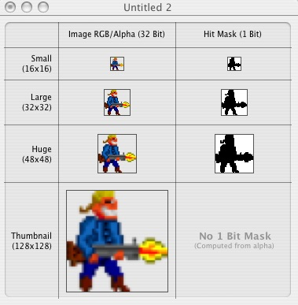
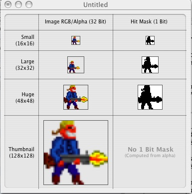

# Ajout de l'icône

Les objectifs étaient les suivants :

 - Dans la barre des tâches Windows et le dock Mac, le jeu affiche une icône représentant le héros.
 - Le fichier exe Windows et le fichier app Mac affichent cette même icône dans l'explorateur/finder.

Ces objectifs n'ont été que partiellement réalisés.

## Table des matières

- [Ajout de l'icône](#ajout-de-lic%C3%B4ne)
    - [Table des matières](#table-des-mati%C3%A8res)
    - [Windows](#windows)
        - [Icône dans la barre des tâches](#ic%C3%B4ne-dans-la-barre-des-t%C3%A2ches)
        - [Icône dans le .exe](#ic%C3%B4ne-dans-le-exe)
    - [Mac OSX](#mac-osx)
        - [Icône dans le dock](#ic%C3%B4ne-dans-le-dock)
        - [Icône dans le .app](#ic%C3%B4ne-dans-le-app)
        - [Méthode de création du fichier blarg_icon.icns](#m%C3%A9thode-de-cr%C3%A9ation-du-fichier-blarg_iconicns)

## Windows

### Icône dans la barre des tâches

Effectué grâce à du code python dans le fichier `mainclas.py` :

    gamIcon = loadImg("gam_icon.gif", doConversion=False)
    pygame.display.set_icon(gamIcon)

Ça marche très bien.

Au passage, cela définit également l'icône en haut à gauche de la fenêtre du jeu.

Lorsqu'on passe en mode plein écran puis qu'on repasse en mode fenêtre, l'icône reste présent dans la barre des tâches, mais disparait de la fenêtre. À priori, ça pourrait être réglé en re-exécutant l'instruction `pygame.display.set_icon` juste après le changement de mode graphique. Ça mériterait d'être testé à l'occasion.

### Icône dans le .exe

Il existe une variable dans `pygame2exe.py` permettant de choisir l'icône : `self.icon_file`.

Mais je n'ai jamais réussi à la faire fonctionner. J'ai spécifié un fichier .ico et un fichier .png, dans les deux cas ça ne fait rien.

Pour information, le fichier `gam_icon.ico` a été créé à partir de `gam_icon.png`, via le site http://convertico.com/. Ces deux fichiers ont été déplacés dans `git/Blarg/doc_diverses/logo_icones`. Ils ne sont nécessaires ni pour le jeu ni pour la création du .exe.

Pour la version mise à disposition sur [indiedb](http://www.indiedb.com/games/blarg), j'avais intégré l'icône en utilisant le logiciel Resource Hacker. Mais je n'aime pas trop cette idée, car on bidouille un .exe avec un logiciel n'ayant rien à voir avec le python ni py2exe, et on ne sait pas trop ce que ça fait car le code source n'est pas librement disponible. Il y a des avertissements ici et là précisant que Resource Hacker peut corrompre les .exe et que si ça arrive, ils déclinent toute responsabilités, blablabla.

J'avais une autre idée :

 - Renommer l'exécutable en enlevant l'extension ".exe".

 - Créer un .bat qui autoriserait temporairement d'exécuter des fichiers sans extension (http://windowsitpro.com/systems-management/how-do-i-execute-exe-files-without-typing-extension) et qui démarrererait le jeu.

 - Convertir ce .bat en un .exe et lui ajouter l'icône, grâce à l'utilitaire "Bat to Exe Converter".

Sauf qu'il est écrit un peu partout sur internet que cet utilitaire contient des virus. Apparemment, ce ne serait que des faux positifs, mais je préfère ne pas prendre de risque.

J'avais une dernière idée : créer un raccourci avec une icône dedans, mais c'est un peu cheap. Juste pour rigoler, j'ai essayé d'automatiser cette tâche en vue de l'ajouter dans `build_blarg_exe.bat`. Pour ceux que ça intéresse, l'embryon de script est ici : `git/Blarg/doc_diverses/logo_icones/createShortcut.vbs`

J'ai trouvé toutes ces idées ici : http://www.wikihow.com/Change-the-Icon-for-an-Exe-File

## Mac OSX

### Icône dans le dock

Effectué grâce au même code python que tout à l'heure, dans `mainclas.py` :

    gamIcon = loadImg("gam_icon.gif", doConversion=False)
    pygame.display.set_icon(gamIcon)

Ça ne marche pas très bien.

Au lancement du jeu, on voit bien l'icône de Blarg dans le dock (car il est pris à partir du .app).

Ensuite, on voit l'icône de pygame pendant quelques secondes : le serpent jaune tenant une manette entre les dents.

Finalement, on revient à l'icône de Blarg, vraisemblablement lorsque le `set_icon()` du code du jeu est exécuté.

Le problème a été signalé ici : https://mail.python.org/pipermail/pythonmac-sig/2009-January/020834.html

Il y a une proposition de solution ici : http://www.mail-archive.com/pythonmac-sig@python.org/msg09705.html

Copie de cette proposition :

> You need two files, a bitmap of the icon, here dubbed "AppIcon.png",
> and an icns file created in Icon Composer, here dubbed "AppIcon.icns".
> Place both folder where your main python script is located then, in
> the main python script, append the following just after pygame.init(),
> *before* pygame.display.set_mode().
>
> pygame.display.set_icon(pygame.image.load('AppIcon.png'))
>
> Next, when you build using py2app, build as follows:
>
> python setup.py py2app --iconfile AppIcon.icns --resources AppIcon.png

J'ai essayé, ça ne marche pas mieux.

### Icône dans le .app

L'icône est intégré dans le .app lors de sa création, lorsqu'on exécute la commande
`python pygame2macapp.py py2app --iconfile blarg_icon.icns`

Le fichier d'icône `blarg_icon.icns` est déjà présent dans le repository, au bon endroit.

Ça marche très bien.

### Méthode de création du fichier blarg_icon.icns

Télécharger et installer l'application iconComposer. (Désolé, je ne sais plus d'où je l'ai récupérée ni quelle version j'ai. Il est possible qu'elle était contenue dans Xcode, que j'ai installé lors d'un moment d'égarement).

**Attention, il semble que ça ne marche correctement qu'à partir du .gif, et pas du .png**

 - Démarrer iconComposer.

 - Prendre le fichier `/code/img/gam_icon.gif` de ce repository et le glisser-déplacer dans la fenêtre de l'iconComposer, (case "image RGB, large 32x32").

 - L'image s'ajoute dans cette case, ainsi que dans le Hit Mask â côté.

 - Prendre l'image qu'on vient d'ajouter dans la case RGB 32x32 et la glisser-déplacer dans la case du haut, puis celle du bas, puis celle de tout en bas.

 - Générer le fichier .icns en sélectionnant l'option idoine dans le menu de l'application. (Je ne sais plus exactement laquelle c'est).

Durant les glisser-déplacer de fichiers et d'images, des avertissements divers sont émis :

 - "Extract Large 1bit mask from data also ? " : répondre "oui".

 - "Image does not have a representation with same dimensions" : répondre "Use a scaled version".

Au moment de la génération de l'icône, la fenêtre doit ressembler à ceci :

Si on part de l'image en .png, ça merdouille et ça ressemble à ça (l'image 32x32 n'a pas la bonne taille) :

Une fois le fichier blarg_icon.icns généré, il peut être directement utilisé pour la création du .app.
