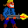
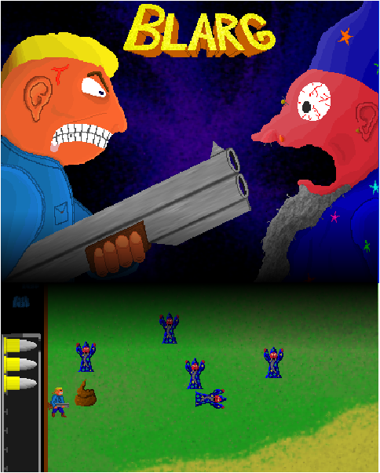

# Présentation sur le site IndieDB

Url d'origine : http://www.indiedb.com/games/blarg

# Infos publiées

**Blarg**

## Summary

You are a honest and peaceful shotgun seller. For an unknown reason, you are teleported in another dimension, full of hostile magicians who wants to transform you into a mana potion. How long will you survive ? Blast as more magicians as possible in this fun shoot-em up. Come on ! There are corpses flying in the air and great sound effects : Bleewwaaaeeuuhhaaarrgghh ! Kaboom ! Sppflleuweerkh ! 

## Profile

Icon : 

Platforms : Windows, Mac, Linux	

Creator : Recher	

Engine : Custom	

Homepage : [Twitter.com](http://twitter.com/_Recher_)

Release date : Released 2011	

## Community rating

Average : 5.5

2 votes

##  Style

Genre : Third Person Shooter	

Theme : Comic	

Players : Single Player	

Project : Indie	

Boxart : 

## Statistics

Rank : 3,522 of 36,533	

Visits : 10,697

Last Update : 5 years ago	

Watchers : 4 members	

Files : 3	

Articles : 2	

Reviews : 1	

## Comments

> **[hiperrr](http://www.indiedb.com/members/hiperrr)** Apr 7 2011	
> 
> so...they want to turn me into a MANA POTON :D
> 
> > **[Recher](http://www.indiedb.com/members/recher)** Apr 7 2011	
> > 
> > Yep. Exactly.
> > 
> > Magicians love mana potions. So, when they meet someone they don't like, they transform him into a mana potion.
> > 
> > unbeatable logic, I would say.
> > 
> > Thanks for having downloaded and for playing my game. Enjoy it ! and its awesome sound effects !
> 
> **[noTformaT](http://www.indiedb.com/members/notformat)** Mar 6 2011	
> 
> Cool "Sound Effect".
> 
> > **[Recher](http://www.indiedb.com/members/recher)** Jan 14 2011	
> > 
> > Thanks for the comments !
> > 
> > The code is nearly finished. Then, I will comment it. (Commented code makes you cool). And then : Release !!!
> > 
> > Follow me on twitter if you're not afraid of French language :
> > 
> > [Twitter.com](http://twitter.com/_Recher_)
> 
> **[wilbefast](http://www.indiedb.com/members/wilbefast)** Jan 11 2011	
> 
> XD love the sound effects
> 
> **[Jok3r098](http://www.indiedb.com/members/jok3r098)** Jan 3 2011	
> 
> tracking! Absolutley FAB
> 

## Videos

Our hero blasts the evil magicians : http://www.indiedb.com/games/blarg/videos/our-hero-blasts-the-evil-magicians

From main menu to death screen : http://www.indiedb.com/games/blarg/videos/from-main-menu-to-death-screen

## Images

In-game screenshot 1 : http://www.indiedb.com/games/blarg/images/in-game-screenshot-11#imagebox

In-game screenshot 2 : http://www.indiedb.com/games/blarg/images/in-game-screenshot-21#imagebox

The intro : http://www.indiedb.com/games/blarg/images/the-intro1#imagebox

Transformed into a mana potion by evil magician : http://www.indiedb.com/games/blarg/images/transformed-into-a-mana-potion-by-evil-magician#imagebox

## Files

### Blarg v1.0 sourcecode

http://www.indiedb.com/games/blarg/downloads/blarg-v10-sourcecode

Filename : blarg_sourcecode.zip

Category : Source Code	

Uploader : Recher	

Date : Apr 6th, 2011	

Size : 1.54mb (1,613,446 bytes)

Downloads : 299

MD5 Hash : 0cd877805790576a936ccc6871ff0a1a 

Description :

Here is the long awaited sourcecode for Blarg. The sound, image and fonts are also included. The game is written in python/pygame, so you can execute it on every platform that supports it (Mac, Windows, Linux, ...) You need to have pygame-1.9.1.win32-py2.5.msi and python-2.5.4.msi, or earlier version, to launch the game directly from the sourcecode. The entry point is the file "zemain.py". You will also find some instructions to transform this source code in a .app file for Mac, and a .exe file for PC. (These instructions are in French, sorry about that). (Frogs rule). The licence for the code, image and sounds is a double one : Free Art License, and CC-BY-SA. You may choose to use the files under one of these license, or both.

Comments on file : 

> **Guest** Jun 27 2013
> 
> Blargintonised
> 
> > **[Recher](http://www.indiedb.com/members/recher)** Feb 8 2015	
> > Thank you.
> > 
> > (well, more than one year later, hope you won't mind).

### Blarg v1.0 for Windows

http://www.indiedb.com/games/blarg/downloads/blarg-v10-for-windows

Filename : blarg.zip

Category : Full Version	

Uploader : Recher	

Date : Apr 6th, 2011	

Size : 4.89mb (5,130,798 bytes)

Downloads : 350

MD5 Hash : dcb8ebf653c69ef3b8b6e200beec2c6b

Description : 

This is the full and final release of Blarg, for Windows. Enjoy ! (And don't forget to download also the source code, if you want to explore it). To install, extract the files from blarg.zip, where you want on your hard disk. Then, double-click on the file "blarg.exe" If you have trouble with the fulscreen display, or if the mouse cursor cannot go everywhere. Launch the game with the file "blarg_windowed_mode.bat". 

### Blarg v1.0 for Mac

http://www.indiedb.com/games/blarg/downloads/blarg-v10-for-mac

Filename : blarg.dmg

Category : Full Version	

Uploader : Recher	

Date : Apr 6th, 2011	

Size : 15.48mb (16,233,299 bytes)

Downloads : 50

MD5 Hash : 812f5c410462e410eebcf906af383c71 

This is the full and final release of Blarg, for Mac. Enjoy ! (And don't forget to download also the source code, if you want to explore it). To install, double-click on the .dmg file, and copy the blarg.app file where you want on your hard drive. If you double-click on the blarg.app directly from the .dmg, before extracting it, the game will work, but nothing will be saved (scores, configuration, ...) So, please, really put it on your hard drive. If you have trouble with the fulscreen display, or if the mouse cursor cannot go everywhere : launch the game with the command "blarg.app FORCE_WINDOWED"

