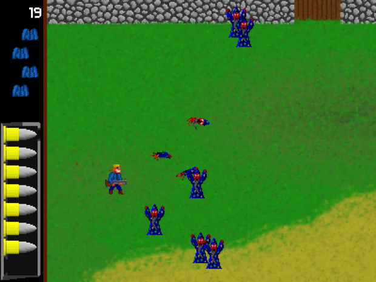
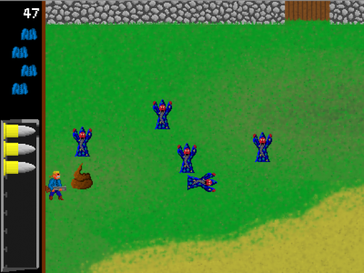
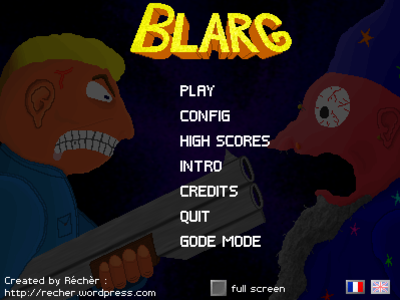

# Publication sur le site pygame

url d'origine : http://pygame.org/project-Blarg-1795-.html

Dates de publication : 

2011-03-03 : v0.99. annonce de la sortie imminente jeu, avec le crowdfunding dans ulule. (le texte publié à ce moment là n'est pas versionné dans ce repository. Il n'a pas été sauvegardé).

2011-05-06 : v1.00. annonce finale, avec les liens de téléchargement.

# Infos publiées

## Tags

2d, shooter, shotgun, ihm, magician 

## Description

- Tons of magicians to kill. Make them burst ! Pure moments of adrenaline and stupid-but-great massacres.

- Amazing sound effects. All made with my voice and a microphone. Shotgun firings, yellings, explosions, poo-transformations. Everything is yargled in almost real noises.

- Not-so-random movements and generations of the enemies. An infinity of unpredictable waves that goes harder and harder.

- All the stuff you normally expect in a "real" game : hi-score savings, keys configuration, presentation menu, scenario written on 5 lines, ...

- English and french languages.

Before public release of the game and its source code, I ask for a contribution. For a modest fee (give what you want, 1 euro minimum), you will have premium-VIP-golden access to Blarg, and its exclusive gode mode. (This mode will not be available in the public release, so this is your only chance to get it !)

For a teasing video, and all the detailed explanations, (how to pay, how to get the game, ...) follow this link : http://www.ulule.com/blarg/

**Edit 6 May 2011** : contribution time is finished ! The game is now available for everyone. See below for download links.

## Changes

Now available for everyone ! Registered on Indie DB. Released under Free Art License, and CC-BY-SA License.

## Links

Home Page: http://www.indiedb.com/games/blarg/

Source: http://www.indiedb.com/games/blarg/downloads/blarg-v10-sourcecode

Windows: http://www.indiedb.com/games/blarg/downloads/blarg-v10-for-windows

Mac: http://www.indiedb.com/games/blarg/downloads/blarg-v10-for-mac

## Screenshot

## Releases

[Blarg - 1.00 - May 6, 2011](http://pygame.org/project-Blarg-1795-.html)

[Blarg - 0.99 pre-release - Mar 3, 2011|(http://pygame.org/project-Blarg-1795-3126.html)

## Comments

### renesd. 2011-05-10

https://disqus.com/by/renesd/

Just gave it a go, and I had fun! There is something pleasant about wizzards and shotguns combined. After a while it becomes impossible to play, since there are too many wizzards moving too fast around the place to avoid. Very funny style.

Keep up the good work!

### Réchèr. 2014-08-18

Thank you very much.

3 years later, I am proud to announce the release of a new game : Kawax.

http://www.pygame.org/project-Kawax-2916-4782.html

### Recher 2014-08-18

Re-bonjour 3 ans plus tard mon cher Maxime.

Si ça t'intéresse, j'ai créé un autre jeu. Dans un autre style, mais toujours avec pygame. Ça s'appelle Kawax.

http://www.pygame.org/project-Kawax-2916-4782.html

Hello 3 years later, dear Maxime.

If you're interested in, I made another game. Not the same type, but stille with pygame. It is called Kawax.

### Maxime (spacemax) 2011-05-21

Hé ! les accents c'est pas de la merde, c'est fait pour les poêtes !!! D'autant que le vrai problème ce n'est pas eux mais l'encodage de la page et/ou de la base de données. Pour la version 2, dommage que le jeux soit en stand-by.

the accents aren't shit !!! They live for the poets if i can tell this !
anyway, the real problem is the encoding of the web page or of the database.
Damage that the game is frozen to the first version !

### Recher 2011-05-10

Note for further use of pygame.org :
crappy accents !!

### Recher 2011-05-10

Merci pour ces commentaires.
Je reconnais que la non-retournabilité du héros a gêné plus d'un joueur. Je voulais pas m'embêter à faire plus compliqué, pour ce premier jeu. Si un jour y'a une seconde version, j'ajouterais cette amélioration.
En ce moment, je bosse sur kawax, mon prochain jeu. A bientôt !

Thanks for this comment.
Some other players reported the problem that the hero can not turn back. I just wanted to do something simple for that first game. I will fix this for next time, (if I ever do a second version).
I am currently working on Kawax, my next game. See you later !

### Maxime (spacemax) 2011-05-07

Jeu sympa,rigolo : dès le début on se marre quand on entre son nom !
Pour l'animation, c'est fluide pas de souci. Juste que les magiciens ils peuvent être dans ton dos et on peut pas se retourner : pas cool.
Les commentaires du codes sont eux aussi à part...

fun game as soon it's starting, as soon we write the name... Good animation for the sprites.
the magiciens can be standing behing you and we can't go back in rear to kill them ; not cool.
The commataries as specially particular...
