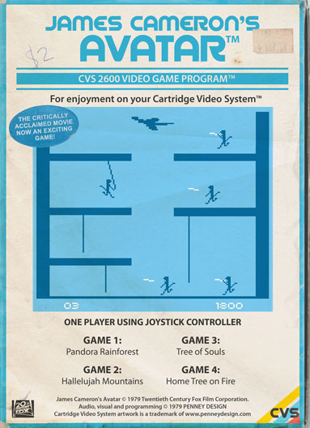
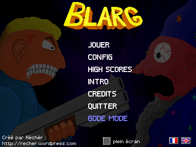
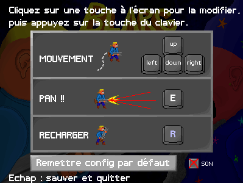

# Programmeurs de jeux : léchez vos créations !!

Publié par Recher le fév. 25, 2011

0 commentaires

Maintenant que je suis presque devenu un développeur de jeux indépendants, je peux, tel le grand maître ninja plein de sagesse, distiller mes conseils auprès de petits élèves notant avidement la moindre de mes paroles dans un carnet à spirale.

Voyez-vous, petits scarabées, à une lointaine époque, les jeux ne se vendait que physiquement, avec une boîte, des disquettes, des CD... La différence entre un "vrai" jeu, et une petite bidouille créée par n'importe qui était là. Si y'avait une boîte dans un magasin, c'était du sérieux.

Ensuite, on est passé aux jeux qui se téléchargent, avec des plates-formes comme Steam, ou Desura. La boîte en carton connut son chant du cygne (coin coin). On utilisa alors un autre critère : l'argent. Si faut le payer, c'est un vrai jeu. Sinon, c'est une bidouille.

Ce critère a également tendance à s'effacer, car il devient de plus en plus possible de jouer gratuitement : MMORPG autres que WoW (Nostale, Maple Story), abandonwares, ROMs de vieilles consoles, jeux totalement libre et gratuit (Freeciv, Wesnoth...), gestion en ligne de tout-et-n-importe-quoi (cochon, ferme, ville, ...), sans oublier la kilotonnes de Flasheries sur Kongregate, Armor Games et autres.

## Cette progressive déliquescence des conventions sociales vidéoludiques est-elle cool ?

Je pense que oui, car ça donne une chance au premier clampin venu de créer des "vrais" jeux. Sans oublier que la programmation est devenue de plus en plus facile au fil des années. Vous savez coder pas trop comme un porc ? vous avez quelques talents en barbouillage ? Vous avez un micro pour enregistrer des sons ? Parfait, vous avez le nécessaire.

Cependant, une convention subsiste encore. Pour que votre jeu fasse bonne impression, vous devez réaliser tout un tas de petites choses autour, pas forcément utiles, mais qui doivent être présentes :

 - Une installation simple : y'a une icône, tu cliques dessus, et ça se fait tout seul. Ne pas demander au joueur d'installer par lui-même tel ou tel librairie, dll, ou application exotique. Ca fait peur aux gens. L'action la plus compliquée qui peut être demandée, c'est de copier des fichiers. Et même ça, c'est limite, pour les super-tanches en informatique.

 - Une image de présentation, voire une animation de présentation. Rien de plus bizarre qu'un jeu qui démarre une partie dès qu'on le lance.

 - Un menu principal, avec au moins l'option "jouer". L'interactivité de ce menu doit être à peu près potable.

 - Des moyens de sauvegarder. Plus ou moins complexes, et plus ou moins automatisées selon votre jeu : high scores, partie en cours, différents profils de joueur, etc.

 - La possibilité de configurer des trucs, et de les garder en mémoire. Surtout la config des touches, que je trouve personnellement putain d'important. Pourquoi ? Parce que certains claviers sont pourris, et ne détectent pas certaines combinaisons de touches. Par exemple, sur mon Mac, je ne peux pas appuyer sur Bas + Gauche + "N". (C'est une histoire de matrice. Je rentre pas dans les détails, ce genre de négligence venant de la part des constructeurs de clavier m'horripile.)

 - Du blabla : scénario, crédits, ... La lecture de ce blabla ne doit pas être obligatoire, car les gens n'aiment pas forcément lire. Mais il en faut, pour les curieux qui s'intéresseraient à vous.

Monsieur Derek Yu, un autre grand sage du jeu vidéo, (qui peut, bien plus que moi, se permettre d'utiliser l'expression "petit scarabée"), l'a souligné dans la règle 7 de cet article : http://makegames.tumblr.com/post/1136623767/finishing-a-game.

Faire toutes ces petites choses satellitaires, c'est long, chiant, et pas fun. Mais ça apporte de la légitimité. Votre jeu doit être être paufiné, finalisé, et léché jusque dans ces moindres recoins !

## Et Blarg alors ?

J'ai la prétention de penser qu'il respecte tous les critères sus-cités. Même si c'est un jeu assez simple, c'est un vrai jeu.

L'autre avantage, c'est que tout le code qui gère les menus est réutilisable pour mes prochaines créations. Ce sont des modules "sur étagère", comme disent les pros de la communication. (Dans quel état j'erre ?)

Il reste juste un défaut. Mon interface est pratique, simple, et elle contient des fonctionnalités utiles. Mais qu'est-ce qu'elle est moche !

La prochaine fois, je ferais plus joli, et visuellement moins chaotique. Juré !

Bon enfin je raconte tout ça, mais rien ne vous empêche de faire des petites créations prototypales, et de les diffuser. Sachez simplement que ça sera très difficilement pris au sérieux.

Sur le site [www.pygame.org](http://www.pygame.org), vous trouverez des tonnes de jeu, plus ou moins sympas et jolis. Beaucoup d'entre eux ne sont pas finis. Ca donne l'impression que le langage python et la libraire pygame ne sont pas fait pour les grands. Moi je suis le héros qui va corriger cette vision des choses auprès de l'opinion public du monde entier.

Sur ce, à bientôt tout le monde. Continuez de parler de moi autour de vous (et de vous autour de moi, pourquoi pas).

Source des images :

 - la dame qui lèche : http://www.2lincolns.com/2009/07/24/gran-turismo-littlebigplanet-in-action-on-the-psp-go-video/

 - la boîte de jeu avatar : http://penneydesign.com/folio_im_retrogamesmodernthemes.html (Allez-y voir, y'a plein d'autres chouettes fausses boîtes de jeux.)

 - Le monsieur sur la Terre avec son n'ordinateur : http://mail2web.com/blog/2009/11/mobile-cloud-based-services/

