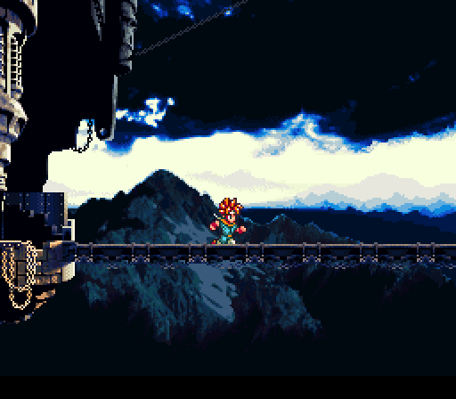

# Dessine-moi un décor de jeu vidéo !!! (avec Pixia)

Publié par Recher le mars 16, 2011

0 commentaires

## Salut les petits princes !

Alors comme ça, tu veux pas un mouton, mais un décor de jeux vidéo ? Haha, charmante petite tête blonde, sais-tu que je suis une véritable tanche dans ce domaine ? Ca ne te dérange pas ? Fort bien. Tiens passe-moi la clé de 12 au lieu de glander.

Mais dis-moi, jeune et fringant inconscient, tu ne préférerais pas que je te montre comment faire, plutôt que de le faire à ta place ? Car, comme le disait si bien Confucius : "Donnes un poisson à un homme, et tu le nourriras pendant une journée. Mais apprends-lui à pêcher, et tu ... Chasse pêêêche et bituuuure ! Nous on respecte la natuuuuure !!"

Pour mon exemple de création de décor, Nous allons donc partir des postulats suivants :

 - Vous êtes une grosse tanche en dessin, comme moi.

 - Vous n'avez pas beaucoup de temps à perdre pour ces conneries. Parce que vous préférez coder et/ou boire des bières.

 - Vous avez entendu parler de The-Gimp, mais vous avez la flemme de l'installer, et l'énormité de ce logiciel vous fait un peu peur. Tout ce que vous voulez, c'est créer une petite image simple, et comme le disait Confucius, avec qui nous sommes maintenant intime : "On ne chasse pas les mouches avec un canon, mais on peut les appâter avec du caca."

 - Vous savez penser fourbe.

## Bien s'équiper comme il faut

Installez le logiciel Pixia. Il est sympa, et les quelques bugs dont il est saupoudré ne sont pas trop gênant. Il est bien evidemment gratuit, sur PC, et se chope ici : http://pixia.free.fr/

Il comporte trouze-plein de fonctionnalités, mais vous n'en utiliserez que 4,03 environ. On n'est pas là pour apprendre à s'en servir, y'a des vrais tutoriaux pour ça. On est là pour apprendre à faire une image à l'arrache.

Pour finir de bien vous équiper à fond, vérifier que vous avez MS Paint. (Le plus grand logiciel de dessin de tous les temps, et le pire, c'est que je le pense un tout petit peu).

## Penser fourbe, donc

Le jeu vidéo dont on veut faire le décor est un peu simpliste. C'est de la 2D, le héros ne peut pas sortir de l'écran, y'a pas de scrolling, et qu'un seul lieu. On va essayer de cacher cette misère avec une bonne dose de fourberie.

Les personnages du jeu mesurent environ 30 pixels de haut. On va donc placer en haut de l'image un mur d'une taille un peu plus petite (mettons 25 pixels). Ca conférera un semblant de vague impression de 3D à l'ensemble. Les personnages seront bloqués en haut, non pas parce que c'est le bord de l'écran et que votre jeu est pouillave, mais parce qu'il y a un mur ! Ha-ha !

Les RPG old-school utilisent eux aussi cette fourberie de fausse 3D, mais de manière plus élaborée, et pour donner l'impression que le jeu emploie différents angles de vue. Par exemple : Chrono Trigger, sur la Super NES.

Dans l'image ci-dessous, le personnage est à peu près en "vue plongeante du dessus".

OMG ! Maintenant, il est vu de côté ! Pourtant, c'est le même sprite !!!

Allons-nous arrêter la fourberie ici ? Que nenni ! On va ajouter une grande porte. Ainsi, le joueur potentiel, regardant un screenshot, va se dire : "Wouhaouw ! Une porte ! Ca veut surement dire que le héros peut l'ouvrir, et partir explorer, que sais-je, une maison, un château, d'autres pays, des univers fabuleux et foutrasmagoriques ! Ce jeu est génial ! Vite vite ! Je dois le télécharger sans plus tarder et donner toutes mes économies à son créateur. Tant pis pour le médicament de ma petite soeur orpheline très malade, elle n'aura qu'à soigner sa tuberculose avec de la médecine douce !"

Ensuite, lorsque le joueur essaie le jeu, il se rend compte que tout ceci n'est qu'une vaste pantalonnade, et que la porte ne sert à rien. Mais c'est trop tard, entre temps, il aura téléchargé le jeu, et aura fait augmenter ma célébrité, mon ego, et mon compte en banque.

Mouaahhahahahahaaa !

Donc un mur avec une porte dedans.

Dans le même ordre de fourberie, mais en moins impactant, on place une petite zone de sable jaune sur la droite. Ca donne l'impression qu'il y a un début de changement de type de terrain, que peut être ça scrolle vers une plage, d'autres pays, des univers fabuleux et foutrasmagoriques, blabla, tuberculose tout ça.

Et pour finir, on décide de placer quelques changement de nuance de couleur, par ci par là. Juste histoire de varier un peu, car le vert, c'est bien, mais le même vert partout, bof.

On part donc sur une image comme ça. (Réalisable sous Paint, sans trop de difficulté).

## Ajouter du schfrouschfrougnage dans le vert

Avec Pixia, utiliser l'outil de sélection polygonesque,  et prenez tout le vert.

Pendant la construction du polygône, vous pouvez cliquer en dehors de l'image, ça rajoutera un point sur le bord, ce qui peut être utile. Suivez approximativement la séparation jaune-vert, en quelques points. Terminez en cliquant sur le bouton droit, ce qui joint le dernier point placé avec le premier.

Dans le fatras d'options situé à droite se trouve deux bidules-doseurs super important. "t" et "d".

Le "t" signifie transparency, et le "d" dithering (dispersion, ou quelque chose comme ça). Laissez le "t" au maximum, et mettez le "d" à pas beaucoup, 20/255 par exemple.

Sélectionnez une couleur parmi les nuances de verts déja présentes dans l'image (mais pas le vert principal). Ca se fait en cliquant-droit sur un pixel de la couleur souhaitée. Il vous faudra peut-être double-cliquer-droit, parce que le premier clic ouvre le menu contextuel qui sert à rien. Bon, c'est Pixia, c'est un peu artisanal comme logiciel, voilà.

Donc vous prenez un vert, vous avez toujours votre sélection de toute la zone verte, et vous faites paf ! le pot de peinture : 

Ca met plein de petits pixels de la couleur choisie, au hasard, dans la zone sélectionnée. Plus y'a de dithering, plus y'a de pixels. D'où l'intérêt de bien doser.

Faites pareil avec les autres nuances de vert. Ajouter aussi un peu de vert plus clair. Hésitez pas à faire Ctrl-Z, ou à remettre un petit coup de vert principal, si vous voyez que ça devient trop n'importe quoi.

Vous pourriez ajouter plein d'autres nuances de verts, non présentes dans l'image de départ, mais ça apporterait pas grand chose, vu le bordel qu'on va mettre juste après.

A la fin, ça donne ça. (J'ai laissé le polygone de sélection, pour que vous voyez bien que c'est pas la peine de se prendre la tête à suivre au pixel près la zone verte).

Attention, l'étape suivante est un peu bourrine. Déplacez tout votre polygone de sélection vers le haut, puis dépacer juste les points du haut vers le bas. Le but c'est de restreindre un peu la zone sélectionnée, car on va faire du bruit !

Appuyez sur l'espèce de bouton de combo-box, en haut à droite : 

Choisissez l'option "bruit" dans la liste déroulante. Dans mon Pixia à moi, j'ai deux options portant ce nom, faut prendre la première.

Augmentez un peu le dithering. Mettons, 40 / 255, et re-paf pot de peinture. Eventuellement, paffez plusieurs fois. On ne doit plus distinguer la forme des cercles, mais les zones de nuances de vert doivent rester. Ca va vous donner un machin comme ça.

On remarquera que quelques pixels gris (provenant du mur), et jaunes (provenant du sable) se sont égarés dans le vert. D'où l'intérêt d'avoir resserré la sélection. Sinon, ça aurait été pire. Les gens intelligents utilisent des layers pour éviter ce genre de gloubiboulga chaotique. Moi non. Pas envie.

Supprimez à la main les pixels gris et jaune, tel le galérien. Pour faire des modifs au pixel près, utilisez l'option Outils -> Loupe. Il vaut mieux remettre le "t" et le "d" à leur valeur d'origine (le maximum) car ils influent aussi sur les actions faites avec la loupe. Enfin je crois.

Il reste une petite zone verte unie, juste en dessous de la porte. Recouvrez là avec un rectangle de vert pas-uni, que vous aurez copié-collé depuis ailleurs. Ce sera pas vraiment raccord, mais on s'en fout.

Pour finir, resélectionnez toute la zone verte, à peu près comme la première fois, baissez un peu le dithering, choisissez le mode "flou" à la place du mode "bruit", et re-paf pot de peinture, éventuellement plusieurs fois. Si y'a du vert qui déborde sur le mur et la porte, c'est pas grave.

## Schfrouschfrougner le jaune

Sélectionnez la zone jaune, reprenez le mode initial (mode "crayon") et un dithering faible, choisissez des couleurs de jaunes un peu plus foncés et un peu plus claires, et balancez-en quelques pixels.

Pas la peine de faire l'étape de bruit pour le jaune, car il n'y a pas de zones de nuances à mélanger. Passez directement au flou.

Sélectionnez la bande délimitant le vert et le jaune. Là pour le coup, la seule chose à faire c'est de mélanger les nuances. Mettez donc du bruit, puis du flou.

Pour finir, démochifiez un peu tout ça en remettant du flou général sur toute l'image, excepté le mur et la porte, et resupprimez à la main quelques petits pixels qu'ont rien à faire là.

## Savoir aimer l'esthétique disco.

Je l'aime bien, ce vert, mais il est pas assez flashy. On va donc l'éclaircir un petit peu. Couleur blanche, sélection de toute l'image, dithering au max, et transparency à 50. Paf, pot de peinture. Plus la transparency est haute, plus l'image sera éclaircie.

## Faire le mur, pas la guerre

Alors là, ça va être chiant. Faut dessiner le charmant et classieux motif du mur. Ca se fait à la main, pierre par pierre, sous Paint, ou sous Pixia avec le mode loupe. J'ai pas de meilleure idée, désolée. Faites juste la forme de chaque pierre, avec une couleur unie. (N'oubliez pas de remettre les "t" et "d" au max).

Vous n'avez pas vraiment besoin de fibre artistique pour ça. Essayez juste de varier les formes, en maintenant un espace de "ciment" à peu près constant. N'hésitez pas à faire des pierres qu'on ne voit qu'en partie, sur les bords haut, gauche et droit de l'image. Ca permet de bien donner l'impression que le mur se continue dans ces directions.

Lorsque l'herbe dépasse du mur, j'ai décidé de la laisser. (C'est une connerie, on verra pourquoi plus loin).

La partie chiante du travail est presque finie, mais pas complètement. Il faut donner du relief. Prenez une couleur plus claire, et mettez en sur les bords haut et gauche de chaque pierre. La lumière vient du haut-gauche. Je sais pas trop pourquoi, mais il paraît que ça fait plus cool que si ça venait du haut-droite.

Et ensuite, une couleur plus foncée, sur les bords bas et droit de chaque pierre.

Entre temps, je me suis aperçu que finalement, ce vert est trop flashy. (Oui je suis incohérent, je vous proutte). Donc sélection de toute l'image, on choisit la couleur noire, une transparency à pas trop haute, et plaf.

Durant toute la création du mur, il faut que la couleur du ciment reste unie. Ca permettra, plus tard, de faire la séparation ciment-pierre. Car comme le disait Jésus, (qui est à peu près une autre version de Confucius) : "Tu t'appelles Ciment, mais on va t'appeler Pierre et sur cette Pierre je poserais mon Eglise."

## Schfrouschfrougner séparément les éléments du mur

Avant tout, nous avons besoin d'une autre image, définissant le masque de séparation entre le ciment et les pierres. Si vous avez une sauvegarde de celle avec les pierres unies, sans relief, c'est parfait.

Sinon, utiliser l'outil "sélection - zone" de Pixia :  et cliquez sur le ciment.

Ca va sélectionner toute la zone de pixels ayant la même couleur. Puis copier-coller ça dans une autre image. Il vous faut les deux parties du ciment, de chaque côté de la porte. Pour ajouter de la sélection à une sélection existante, cliquez tout en appuyant sur la touche "Ctrl".

Le but étant de récupérer ce genre de chose :

Copiez-collez le mur dans une autre-autre image, changez la couleur du ciment pour celle des pierres ("Sélection - zone" sur le ciment, puis plaf-pot-de-peinture avec la couleur de base des pierres).

Sélectionnez toute l'image, et schfrouschfrougnez-là comme pour le sable. (Ajout de quelques pixels foncés et clairs, puis du flou) (Puy-du-fou).

J'ai également éclairci un peu, histoire d'avoir un vrai contraste entre les cailloux clairs et le ciment foncé.

Créez une dernière image, de la taille du mur, et remplissez-là entièrement avec la couleur du ciment. Schfrouschfrougnez.

## Fuuuuu-sion !!

On a les cailloux, on a le ciment, on a l'image globale. Faut rassembler tout ça. (Un type intelligent aurait tout géré dès le départ avec des layers. Vous ais-je fait part de mon opinion personnelle concernant l'intelligence ?)

Prenez le masque, sélectionnez tout le ciment, et copiez-collez le sur les cailloux.

Dans cette image, re-sélectionnez le ciment, puis : Menu - Sélection - Inverser. Ainsi, vous aurez tous les cailloux, sans le ciment. Copiez-collez dans l'image du ciment schfrouschfrougné.

Et finalement, balancez le tout directement dans l'image principale

Bon, je sais plus trop comment je me suis débrouillé, mais au niveau de l'herbe, ça merdouille. (J'aurais du effacer les bouts d'herbe qui dépasse au moment de dessiner le mur). C'est pas grave.

## Joindre l'herbe (et non pas : herber le joint).

Il reste encore un peu de bidouille à faire à la main, mais c'est pas long.

Dans cette espèce de combo-box,  vérifier bien que vous avez la taille de pinceau "1x1".

Remettez le mode de dessin en crayon normal, mettez la transparency vers 120 / 255, zoomez, et tracez vaguement des bouts d'herbe, de ci de là, le long du bas du mur. De temps en temps, changez la couleur de traçage en cliquant-droit sur n'importe quelle pixel vert à portée. Vous pouvez repasser plusieurs fois au même endroit si vous voulez plus d'herbe. Profitez-en pour essayer de cacher les bouts de cailloux moches.

Et pour finir, schfrouschfrougnez légèrement la porte, avec quelques pixels plus foncés et plus claires, et un petit coup de flou.

Et Vwala !!

## Conclusion et ouverture vers le futur

Il est évident qu'avec un peu plus de maîtrise de Pixia, et un peu plus de talent, on arriverait à faire beaucoup mieux. Mais là, par rapport au temps investi, l'image est assez correcte. N'oubliez pas que le plus important, ce sont les fourberies élaborées au départ.

Pour mes prochains jeux (car il y en aura une foultritude, vous vous doutez bien), j'ai pu recruter un barbouilleur effectuant un travail plus rapide et moins grumeleux. Je continuerais de m'occuper des sprites, car j'aime bien faire des petits dessins très précis. Mais pour les grandes images, je compte me décharger sur une talentueuse personne.

Sur ce, je vous laisse, j'ai du code à finir de commenter.

## source des images

http://www.paperstone.co.uk/News/2011/Enormous_Fountain_Pen_Unveiled

http://forum.canardpc.com/showpost.php?p=4034797&postcount=4319

http://www.lamemoiredupad.net/361-chrono-trigger.php

http://picturesinthesand.blogspot.com/2010/11/my-5-favourite-minor-simpsons.html

http://pixfr.eu/image/0d6c88a6/

http://newshousedesign.com/flashy-chair-design-from-kiwi-pom-its-disco-chair/

http://akwanet.servhome.org/jesuslol.php

http://dbzgotenks.skyrock.com/955709848-Gogeta.html

http://fr.dreamstime.com/photographie-stock-libre-de-droits-masque-de-yaourt-de-concombre-image603257