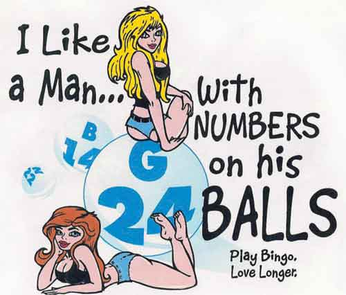
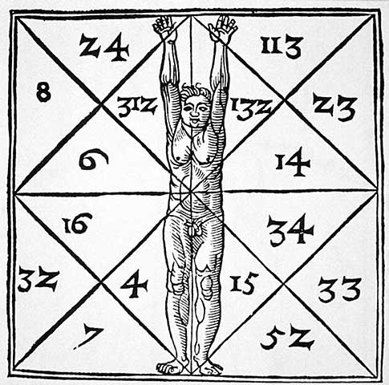
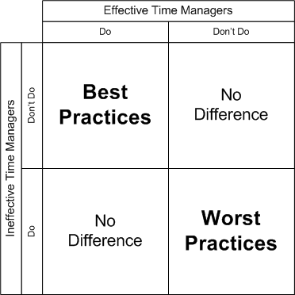
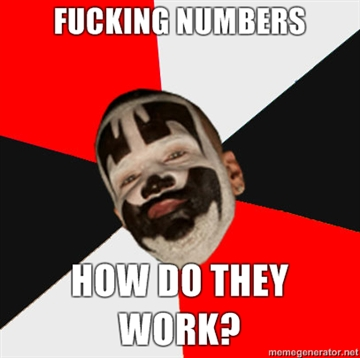

Url d'origine : http://fr.ulule.com/blarg/news/hmmmm-tu-aimes-chiffres-1163/

# Hmmmm... Tu aimes les chiffres ?

Publié par Recher le mars 31, 2011

2 commentaires

HHHmmmmmmmm  sslluululuuuurrppp !! RrrhhaAAAAAAHH ! T'AIMES LES CHIFFRES! HEIN COQUINE! VAS-Y ! CRIE-LE QUE T'AIME CA !

OH OUI !! OH OUIIIII !

TU LE SENS MON GROS 8 ? TU LE SENS ? ET MON 5 ! TU VEUX QUE JE TE METTE MON 5 !

HAAAAA !! HHMMMMM ! OOOUUUIIII !!! HHAAAWWWRRRAAAOOUUUUAAAAHHHHRRRRRRRRR !!!

Sur cette intro d'un goût exquis, je vous annonce que j'ai terminé le code du jeu, ainsi que les commentaires. C'est tout beau et tout joli.

Du coup, je me permet de balancer une ribambelle de chouettes statistiques et de "métriques de code", comme on dit quand on s'y connait dans le méter. Tout le monde sait que les humains aiment les statistiques, or, j'aime les humains. C'est donc l'occasion rêvée.

## Le code

Blarg, c'est : **55** fichiers python, totalisant **5 049** lignes de code, tototalisant **172 300** caractères. A ces caractères, il faut ajouter **43 331** espaces utilisés pour les indentations.

Les plus aguerris d'entre vous me diront : "**43 331** espaces d'indentations ? What the phoque ? Ce n'est pas un multiple de 4, ni même un multiple de 2. Tu indentes de 1 en 1, ou bien ?

Ce à quoi je répondrais : "ou bien."

Quand la définition ou l'appel d'une fonction est super long, je coupe au milieu de la liste des paramètres, et ça indente là où ça tombe. Par exemple :

    def machin(param1, param2,
               param3, param4):

(Ouais nan, laissez tomber, on voit rien comme ça)

Mais sinon j'indente à 4, et mes lignes de code ne dépassent jamais **79** caractères.

## Les commentaires

Blarg, c'est également **7 978** lignes de commentaires, totalisant **493 259** caractères, auquel il faut ajouter **65 524** espaces d'indentation.

Cependant, tous mes fichiers débutent par le même en-tête, avec la licence (libre of course), quelques liens et un peu de blabla. Il y en a pour **15** lignes et **852** caractères.

On va donc considérer que Blarg comporte **7 978 - 15 * 55 = 7 153** lignes de commentaires utiles, et **493 259 - 852 * 55 = 446 399** caractères de commentaires utiles. "Utiles" étant un bien grand mot, car je suis parfois verbeux (vous vous en étiez aperçu, non ?), et il y a des endroits où je raconte carrément n'importe quoi. Je vous laisserais découvrir ça par vous-mêmes.

Mes commentaires ne dépassent jamais **99** caractères. C'est plus que pour le code, car tel est mon bon vouloir. (Et puis ça évite de s'étendre sur trouzemille lignes. Y'en a déjà bien assez !)

Il y a également **4 385** lignes vides, et **936** lignes comportant uniquement une triple-double-quote. Qu'est-ce à dire ? En python, on peut définir des blocs constituant une chaîne de caractères géantes, en l'encadrant de trois guillemets à la suite. Or, c'est une bonne pratique de placer une chaîne de caractère de ce type au début d'une classe ou d'une fonction, afin de décrire le bidule en question.

Pour ceux qui ne savent pas ce que sont les "bonnes pratiques" : il s'agit de rituels professionnels, mis en place par Patrick Bonne, un collègue à moi.

Au total, cela nous fait **18 348** lignes et **774 414** caractères.

Pour vous donner un ordre de grandeur de ce que cela représente : si on s'amusait à écrire sur une même ligne tout mon programme, en utilisant la police Courier, avec une taille de **213 302 386 128 440** points, on obtiendrait une longueur de **9 460 730 472 580 800** mètres. Soit la distance de notre planète à l'étoile Alpha Centauri A. Incroyable non ?

Ceci dit, ces chiffres ne sont pas définitifs, car il me reste encore à ajouter dans le générique les noms/pseudos des contributeurs de plus de 5 euros, ainsi que leur site/blog éventuel. J'en profite pour signaler que y'en a des qui m'ont toujours pas dit ce que je devais leur mettre. Manifestez-vous messieurs-mesdames, sinon je me verrais contraint de souiller votre jardin intime avec encore plus de chiffres. Et paf !

Sur ce, revenons au sujet principal.

## Fonctions et classes

Blarg comporte **365** fonctions et **52** classes. Soit une fonction par jour, et une classe par semaine ! LOWL !

C'est marrant, je crois que c'est le genre de super-conclusion qu'énonceraient, sans rire, les managers de mon boulot-alimentaire, lorsqu'ils iraient faire des super-plannings de tâches et de "suivi de l'activité".

Evidemment ça ne correspond à rien. Dans le code, y'a des fonctions toutes petites et d'autres énormes. Tu la sens ma grosses fonction ? Tu la sens ? Bon, ça suffit.

Mais Blarg, ce n'est pas que du code. C'est aussi ...

## des images.

Ce jeu possède **65** fichiers images, rassemblant au total **601 063** pixels, chacun d'eux doté d'une couleur qui a été amoureusement et soigneusement choisie.

Si on imprimait ces images avec des pixels d'une surface de **10 132 049** km², on recouvrirait entièrement le soleil ! Je sais pas si vous vous rendez compte de l'awesomeness du truc !

Mais qu'est-ce qui fait la force de Blarg ? Quel est son cachet si particulier ? ce petit plus qui fait la différence par rapport aux autres jeux ?

## Les effets sonores bien sûr !

Le jeu compte **88** fichiers sons, totalisant pas moins de **53.3** secondes de pur "arrgghh" et autres "aaahhaaawwouuuaaaââââggghh", le tout entièrement fait à la voix.

Supposons que vous souhaitiez écouter tous ces sons, les uns après les autres, sans discontinuer, et cela **59 207 505** fois, vous seriez centenaire sans même avoir vu le temps passer ! C'est pas de la oufferie totale ça ?

## Le temps

Et pour finir, une dernière petite statistique qui fait un peu peur. J'ai débuté la création de ce jeu au début du mois de mars, mais de l'année dernière. Il m'a donc fallu **13** mois pour concocter ce truc ! C'est quand même super long pour ce que c'est.

A ma décharge (oui, car j'ai une décharge) :

 - Je suis parti de **zéro**, avec peu de connaissances sur le sujet. (Je connaissais python, mais pas pygame).

 - J'étais vraiment tout seul, pour tout faire.

 - Je bossais principalement sur mon mini n'ordinateur, dans le bus qui m'emmène à mon boulot-alimentaire-de-daube. Je bossais aussi les week-end, avec modération. Ca nous y fait, à la louche : (**220+20**) jours de travail * (**1h30** de trajet en bus) + **56** week-end * **1**h environ par week-end. Soit **416** heures. C'est pas tant que ça.

Ajoutons à cela les divers éléments susceptibles de nuire à la concentration pouvant survenir dans un bus : jeunes pubertaires avec leur musique de mayrde, vieilles qui s'engueulent avec le conducteur, travailleurs du C.A.T. qui veulent absolument raconter leur vie géniale, gens de qualité proposant un petit verre de Ricard (dans un bus, oui), etc.

Mais, comme je l'ai dit dans la présentation : si je fais ces "oeuvres", c'est pour avoir le plaisir de programmer des trucs cools, sans contraintes, sans délais improbables, et à ma façon. Le tout c'est d'arriver au bout, quel que soit le temps et l'énergie dépensée.

Sur ce, je vous donne rendez-vous dans quelques jours, pour la sortie publique officielle. Et après, je repartirais sur d'autres projets de jeux. J'ai bien evidemment plein d'idées.

A bientôt bande de joyeux fripons !

## Source des images (en vrac) :

http://talklikeaphysicist.com/category/tuesday-physics-tattoos/page/4/

http://www.kunst-fuer-alle.de/english/fine-art/artist/image/nach-flemish-school/14455/1/101653/the-proportions-of-man-and-their-occult-numbers-from-'de-occulta-philosophia'-libri-iii,-by-henricus-cornelius-agrippa-(1533)-il/index.htm

http://www.latestbingobonuses.com/forum/bingo/funny-bingo-pics/?msg=125873;PHPSESSID=e7c80046e2dc8df3263a26a18447176d

http://www.timethoughts.com/timebest/best-practices.htm

http://memegenerator.net/Insane-Clown-Posse/ImageMacro/5365287/Fucking-Numbers-How-do-they-work

http://www.failburner.com/fail/tatoo-fail/patrick-swayze-est-un-centaure/

http://wallpapers.free-review.net/12__3D_Hot_Planet.htm

http://www.popartuk.com/art/james-ryman/play-it-loud-pp31723-poster.asp

http://hupotasso.files.wordpress.com/2008/12/light-bulb-on-in-a-row-thats-off.jpg

## Commentaires

### Recher (Créateur)

il y a 5 années, 4 mois

Merci pour le compliment, noble ménestrel !

La proposition (sérieuse ou pas, mais on va dire que oui) est fort cossue. Je suis allé voir ton blog hier, et je reconnais m'être fait temporellement happé par certains articles (/b/razil, entre autres).

Mais c'est pas évident de trouver des morceaux de temps entre mes occupations existantes. J'écris déjà des bêtises dans mon blog à moi, dans le magazine 42, dans Ulule bien entendu, sans oublier les choses annexes tel que mon boulot-de-survie, et les besoins incompressibles tel que les toilettes.

A l'occasion, je pourrais peut-être te tambouilliser un petit quelque chose. Un truc presque culturel, comme par exemple "mes souvenirs de moments bizarres dans les jeux vidéos de mon enfance".

Faut voir. Hmmm... Tu aimes les mots ? Oh oui, crie-le que tu aimes les mots.

### cedric-2

il y a 5 années, 4 mois

Recher tu es un génie, viens bloguer avec moi ! http://boumbox.wordpress.com/
