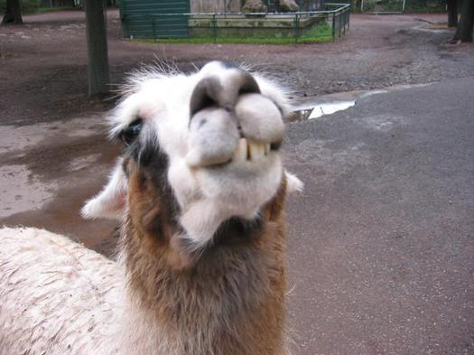

Url d'origine : http://fr.ulule.com/blarg/news/youpi-1191/

# Youpi !

Publié par Recher le avr. 3, 2011

0 commentaires

## Bien le banjoir messieurs-mesdames.

Eh bien voilà, la récolte des brouzoufs est terminée. Merci beaucoup à vous tous, pour vos dons, vos "j'aime ça" facebookiens, vos tweets, vos mails, vos commentaires, et vos hurlements dans un micro pour certain.

On termine sur une petite fortune, quand même : 50 euros, (auquel il faudra retirer les taxes de ces vilains capitalistes de paypal, mais c'est pas grave). Honnêtement, je n'étais pas sûr d'arriver à une telle somme. J'ai eu des dons honorables de la part de gens que je connais, et des dons plus modestes de la part de gens que je ne connais pas. Dans les deux cas, ça me fait très plaisir. Je me sens heureux, comme Serge Lama dont voici la photo.

(Serge Lama, c'est un pote à Amélie Poulain et Joe Cocker)

Comme annoncé dans la description du projet, l'argent servira à du n'importe quoi non défini. Une partie servira à inviter ma chérie au resto. Et le reste atterrira certainement dans mon compte courant, pour y finir englouti dans la houle des transferts pécuniers quotidiens. Pas très fun, me direz-vous. Le but n'était pas vraiment de gagner de l'argent, mais de tester si "ça marche". Et je confirme, oui, ça marche.

La version finale du jeu, disponible pour tout le monde, sera bientôt prête. Je dois juste faire les derniers tests, régler cette histoire d'icône, et uploader le tout sur indieDB. Il va de soi que le mot de passe donné aux contributeurs continuera de fonctionner sur la version publique du jeu.

A ce propos, je vais rediffuser la news "privée", pour expliquer comment récupérer la version d'avant-première du jeu, et pour donner ce fameux mot de passe. Ceux qui ont loupé la première news réservée aux soutiens vont enfin pouvoir s'éclater à tuer des magiciens à l'infini !

Pour ceux qui ont donné 10 euros, je vous enverrais vos images dédicacées juste après la publication du jeu. Si vous savez vous servir de votre ordinateur, vous serez peut-être même en mesure d'intégrer cette image dans le jeu, pour vous faire votre version unique ! Ouay !!

En attendant, voici la liste des noms et liens des gentils donateurs, tel qu'elle apparaîtra dans le générique. A priori je n'ai oublié personne, et les liens web fonctionnent. N'hésitez pas à venir crier dans les commentaires si j'ai bourdé quelque part.

Toutes les personnes ayant donné 5 euros ou plus sont mentionnées. Le classement est fait d'abord selon la somme donnée, et ensuite selon la date du don.

**--- assistant aux effets sonores ---**

**Ckyfran, qui vous conseille: http://jeanbamin.com**

**--- super-donateuse ---**

**Ceska2007**

**--- joyeux mécènes ---**

**Cuningham**

**Le Corse**

**Captive Studio http://www.captive-studio.com/**

**cemonsieur http://www.ulule.com**

**Platypus Creation http://www.platypus-creation.com**

Par ailleurs, je me suis fendu d'un petit compliment, plus ou moins personnalisé, pour chaque donateurs. Le tout se trouve dans les commentaires, par ici : http://fr.ulule.com/blarg/comments/

(Ah, il manque juste la toute dernière personne qui a donné 1 euro. Je fais ça dès demain, c'est promis !)

## source des images :

Serge Lama :

http://www.wunderground.com/blog/Chris/comment.html?entrynum=2

Borat :

http://seattlest.com/2008/01/02/your_votes_are.php

