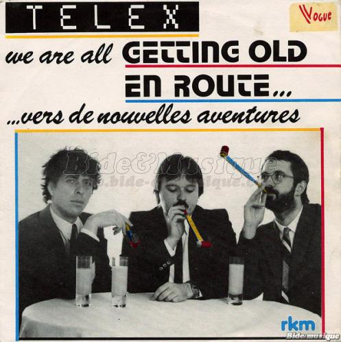

Url d'origine : http://fr.ulule.com/blarg/news/-jeu--1254/

# Le jeu est là !

Publié par Recher le avr. 10, 2011

0 commentaires

Ca y est, j'ai tout terminé : les commentaires, la relecture, les tests, et les diverses petites choses de finalisation.

Le jeu est maintenant disponible pour tout le monde, gratuitement, sous les licences Art Libre et CreativeCommons-BY-SA.

Vous pouvez dorzédéjà le récupérer sur le site de jeux vidéos indépendants Indie DB : http://www.indiedb.com/games/blarg/downloads

## pour Windows :

Téléchargez la version idoinement nommée "Blarg v1.0 for Windows", dézipper le fichier obtenu quelque part, et doubleucliquez sur blarg.exe.

Il est possible que l'affichage soit décalé ou tourné, ou que le curseur de souris soit à la ramasse. C'est à cause de ma résolution bizarre en 400x300, qui a du mal avec certains écrans. Dans ce cas, doubleucliquez sur le raccourci blarg_windowed_mode.bat, pour lancer le jeu en mode fenêtre. Ce sera moins rigolo, mais ça fonctionnera à coup sûr.

## pour Mac :

Téléchargez la version Mac, doubleucliquez sur blarg.dmg, et copiez l'application blarg.app où vous voulez sur votre disque dur.

Il faut vraiment la copier. Si vous l'exécutez depuis le .dmg, ça fonctionnera, mais les scores et la config ne seront pas sauvegardés. (Si quelqu'un peut m'expliquer comment on fait des .dmg avec les droits d'écriture dedans, ça m'intéresse.)

Le risque d'un mode plein-écran daubé est moindre sur Mac, mais si jamais ça arrive, exécutez cette commande :

blarg.app/Contents/MacOS/blarg FORCE_WINDOWED

## Pour Linux, ou autres :

Je connais pas trop les z'arcanes de ce myrifique système, désolé. Je vais donc me contenter des banalités d'usage.

Téléchargez le code source du jeu (disponible aussi sur Indie DB, c'est le même lien), installez le python 2.5.4 et pygame 1.9.1, ou plus récents, placez-vous dans le répertore du code source et lancez la commande "python zemain.py".

## Ouatte else ?

Encore-encore merci à toutes les personnes m'ayant soutenu, moralement ou financièrement. Votre mot de passe secret pour être invincible fonctionne également sur cette version du jeu, of course. Donc vous faites comme vous voulez : soit vous gardez votre version d'avant-première, soit vous prenez celle-là, soit les deux. Elles sont sensiblement pareilles.

Le montant de vos dons est en cours de téléchargement sur mon compte Paypal. Ca devrait bientôt être totalement effectué, et ma chérie et moi, on va pouvoir se le faire, ce resto.

## Et maintenant, en route vers de nouvelles aventures !

Je suis dorzédéjà en train de travailler sur mon prochain jeu. Pour le titre, j'hésitais entre "Le stagiaire" et "La machine à café". Mais finalement on va faire plus simple, et nommer cette future création "Kawax". Je ne veux pas révéler trop de choses pour l'instant, vous allez donc vous contenter d'une liste de mots venus de nul part :

 - Centimes de brouzouf et jetons de caddie.

 - Quêtes et PNJ, avec les voix faites par moi, cela va de soi.

 - Jolis dessins classes, pas forcément faits par moi, ce qui vous permettra de conserver vos yeux en état de marche.

 - Touillettes, tasses, gobelets, tâche géante, chewing-gum, clopes et peut-être capotes.

A priori, je ne posterais pas d'autres news dans ce projet. Sauf peut-être quand Kawax sera plus avancé, ce qui n''est pas pour tout de suite. En attendant, je vous donne donc rendez-vous dans les divers machins suivants, que je mets approxi-régulièrement à jour :

 - Mon blaugue : http://recher.wordpress.com

 - Mon touittère : http://fr.twitter.com/_Recher_

 - Le magazine 42 dans lequel j'officie régulièrement : http://42lemag.fr

Sur ce, je vous laisse avec le mot  : "Youpi"

## Source des images

http://www.touati-immo.com/article-le-campus-universitaire-nicolas-de-condorcet-ouvrira-ses-portes-en-2016-53401745.html

http://meloceondi.mabulle.com/index.php/2007/10/18/93639-yep-yep-yep-et-youpi-tralala

http://www.bide-et-musique.com/song/1796.html