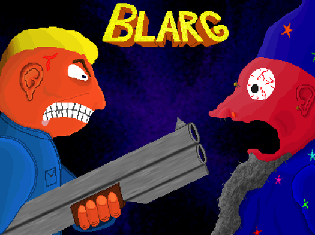
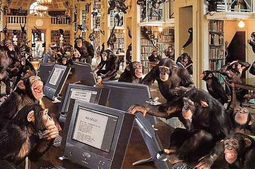
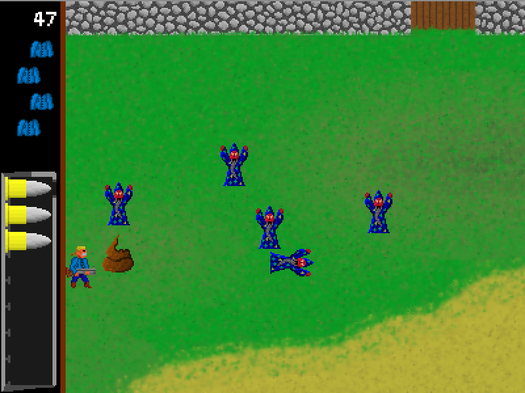
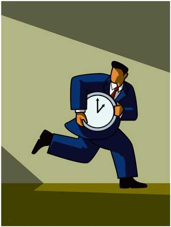

# Présentation du projet

## Données diverses

Url d'origine du projet : http://fr.ulule.com/blarg/

Url de la vidéo : https://www.dailymotion.com/video/xgx2in_blarg-demo-v2_videogames

50 € collectés sur un objectif de 10 €

Financé le 3 avr. 2011

8 news ;
13 commentaires ;
11 contributeurs ;

### Participants

Fan anonyme ;
Fan anonyme ;
cemonsieur. Montréal ;
captivestudio. Boulogne-Billancourt ;
Fan anonyme ;
Fan anonyme ;
ceska2007 ;
cedric-2. Ma nuit chez Ulule ;
cuningham. dans un pays froid et pluvieux ;
Fan anonyme ;
Fan anonyme ;

### Les fans

Recher ici ;
barredevie Paris, France ;
nomansland Nomade ;

## Contreparties

Pour 1 € ou plus (4)

La version spéciale du jeu, en avant-première, avec le mode invincible !

Pour 5 € ou plus (5)

Jeu en avant-première et mode invincible + Votre nom/pseudo dans le générique, ainsi qu'un lien vers votre site ou votre blog.

Pour 7 € ou plus (0)

Même chose que ci-dessus +
Une dédicace de l'image de présentation. (Dédicacée sous Paint et envoyée par mail, parce que le cheap, c'est chic)

Pour 10 € ou plus (2)

Même chose que ci-dessus +
Participez activement au contenu artistique !
Imitez le râle d'un magicien qui meurt, et envoyez-moi le fichier son. Il sera intégré dans le jeu.
Vous serez crédité dans le générique comme "assistant aux effets sonores".

Pour 20 € ou plus (0 / 1)

Même chose que ci-dessus +
Nommez le personnage principal.
Notre héros est un vendeur de fusil à pompe tout ce qu'il y a de plus honnête. Il se retrouve par hasard téléporté dans un univers parallèle rempli de magiciens. Mais quel est son nom ? A vous de décider.
Vous serez crédité dans le générique comme "co-scénariste principal"

## Texte principal

### A propos

Il existe des jeux vidéos avec des magiciens, il en existe aussi avec des fusils à pompe, mais personne n'a jamais osé cross-overiser les deux. C'est maintenant chose faite avec Blarg. Il sera disponible sur Mac et sur PC, et sera téléchargeable depuis le site de jeux vidéos indépendants indieDB : http://www.indiedb.com/games/blarg

Pourquoi ai-je créé ce jeu ?

#### Pour vous offrir adrénaline, défouloir, et onomatopées

Envie d'un petit instant de stupidité jouissive ? Alors, démarrez une partie de Blarg, et faites voler des magiciens en morceaux, sous un déluge de "arrggh!!" "bblleeeaaakkhhh" et autres "gghhrouhhoohouuuwofff". Les bruitages ont tous été créés avec mes petites cordes vocales musclées.

#### Pour secourir les cerveaux des informaticiens

Les développeurs en informatique sont souvent frustrés par leur activité professionnelle. On leur demande de programmer à l'arrache, afin de tenir le délai de avant-hier-au-plus-tard-en-urgence. Cette méthode de production génère des kilo-octets de programmes mal fichus, illisibles, buggés et atteints de cancers du copier-coller. Dans mon travail du monde réel, j'ai vu des lignes de code affreuses, traumatisantes, que mes yeux ne pourront jamais oublier.

Partir en guerre contre cette montagne d'horreurs serait une chose impossible. Alors j'ai décidé de me construire mon petit oasis de code personnel. Si j'ai créé ce jeu, c'est tout d'abord pour sauver mon propre cerveau, et en le partageant, j'en sauverais peut-être d'autres.

Le jeu, le code source, les images et les sons seront disponible librement et gratuitement, sous les [licences Creative Commons CC-BY-SA](https://creativecommons.org/licenses/by-sa/2.0/fr/), et [Art Libre](http://artlibre.org/). Vous pourrez consulter, modifier, et mâchouiller le tout selon les termes de l'une ou l'autre de ces licences.

C'est écrit en python, avec la librairie multi-plateformes pygame. Le python est un langage de programmation beau, simple, et lisible. Je me suis appliqué à faire un code factorisé, découpé en objets indépendants, et commenté. Bien sûr, je ne peux pas avoir la prétention de programmer à la perfection, d'autant plus que chacun a son style. Mais je suis assez fier de ce que j'ai fait.

### A quoi va servir le financement ?

En fait le jeu est déjà terminé, et son développement n'a rien coûté, sinon du temps. Mais pour l'instant, je le garde jalousement en otage dans mon ordinateur. **J'ai fixé la limite à 10 euros, parce qu'il fallait bien en mettre une, mais ce serait bien qu'elle soit dépassée. Le but réel est d'obtenir le plus d'argent possible.** Pourquoi une telle cupidité ?

 - Parce que je veux évaluer l'intérêt que pourraient avoir les gens envers mes créations vidéoludiques. (Et éventuellement, dans un futur lointain, changer de métier)

 - Parce que "libre" n'est pas forcément synonyme de "totalement gratuit".

 - Parce que gagner des sous, ça fait cool, et on est bien plus pris au sérieux lorsqu'on y parvient. (Même si ce qu'on produit n'est pas sérieux en soi).

**Contribuer à ce projet est, pour vous, votre seule chance d'obtenir une édition spéciale du jeu avec le mode invincible, ainsi que de devenir connu simplement en hurlant dans un micro (cf. les contreparties proposées, ci-à-droite). De plus, vous aurez accès au jeu en avant-première, dès que vous aurez effectué votre contribution.**

Et que ferais-je de cette montagne de brouzoufs ? A priori : n'importe quoi. Je compte offrir un bon restau à ma chérie, m'acheter des BD, des nouveaux slips...

### A propos du porteur de projet

Je m'appelle Réchèr. Je suis ouvrier-codeur dans une importante entreprise qui vend du temps de cerveau d'informaticien disponible. Entre deux rafistolages hasardeux de programme bancal, je tente de voler un peu de ce temps, en travaillant sur des projets personnels qui me tiennent à coeur.

Je sévis sur le blog [recher.wordpress.com](recher.wordpress.com), où je raconte diverses geekeries, que je ponctue d'images érotiques de femmes rondes.

Je commet également des articles pour le magazine 42. (Le magazine par, pour, sur, dans les geeks)

J'ai l'intention de faire d'autres jeux, selon le même mode de production et de libération. Mon prochain titre s'appelera "Le Stagiaire", et sera un peu plus subtil que Blarg. Vous pouvez suivre à peu près quotidiennement les cahots du processus de création, sur [mon touittère](https://twitter.com/_Recher_).
